<center>
<p></p>
<h1 style="font-size:50px">Analyzing and Predicting NBA Most Valuable Player Award</h1>
<h4 style="font-size:20px">Mary Hood, Manpreet Sidhu, Alex Rothman</h4>
<hr>
</center>


<center>
<h1 style="font-size:30px">Introduction</h1>
</center>
<p>
The National Basketball Association (NBA) is the leading professional basketball league in North America. From October to June, millions of viewers will be watching games on TV or in-person, cheering on their favorite players and/or teams. The league consists of 30 teams and is divided into two conferences, the Eastern and the Western conferences. Each team plays 82 games during the regular season. After the regular season is over, teams compete in playoffs in order to qualify for the NBA Finals. The NBA Finals are when the winning teams for both conferences faceoff in a best-of-seven game series for the title of NBA champions and for the Larry O'Brien Championship Trophy. After the series is over, the NBA hosts an awards ceremony celebrating the accomplishments of its players.
</p>
<p>
The finalists for the NBA awards are announced during the NBA Finals and then revealed during the ceremony weeks later. The NBA awards are given out based upon skill and performance, but also for fan favorite moments or highlights. Every year viewers tune in to find out if their favorite players won awards like Rookie of the Year (ROY), Defensive Player of the Year (DPOY), and most importantly Most Valuable Player (MVP). Our project will be analyzing and predicting the result of the MVP award. The MVP award is given to the best performing player of the season. It is important to note that the award is given out based upon regular season statistics only. This means that a player's playoff and potential NBA Finals performance should have no impact on their odds of winning the award. Before we attempted to predict the winner of the MVP award this year, we decided to look into the statistics of all players and the MVP front-runner candidates of the 2018-2019 season. The winner of the MVP award last year was Giannis Antetokounmpo, a forward on the Milwaukee Bucks, who was in his sixth season in the NBA.
</p>
<br> 
<figure>

<center>
<figcaption>Giannis Antetokounmpo holding the Maurice Podoloff MVP Trophy</figcaption>
</center>
</figure> 

<center>
<h1 style="font-size:28px">Getting Started With The Data</h1>
</center>


```python
# Imports any necessary libraries
import pandas as pd
import numpy as np
import matplotlib.pyplot as plt
import seaborn as sns
import re
from datetime import datetime
from sklearn import utils
from sklearn.model_selection import train_test_split 
from sklearn.neighbors import KNeighborsRegressor
from sklearn.tree import DecisionTreeRegressor
from sklearn.linear_model import LinearRegression
from sklearn.ensemble import RandomForestRegressor
from sklearn.preprocessing import StandardScaler
pd.set_option('display.max_columns', 500)
```

<center>
<h1 style="font-size:24px">2018-2019 NBA Season Stats</h1>
</center>
<p>
    The following code snippet populates a Pandas Dataframe with statistics on all NBA players during the 2018-2019 season. The nba_stats dataframe will hold the statistics from the Basketball Reference "per game" player statistics dataset found <a href="https://www.basketball-reference.com/leagues/NBA_2019_per_game.html">here</a> and from the "advanced" player statistics dataset found <a href="https://www.basketball-reference.com/leagues/NBA_2019_advanced.html">here</a>. The two datasets are then merged together using an outer merge so that the the dataframe will contain both the "advanced" and "per game" statistics of every player that season. Finally, we merged in a dataset that contains the standings for every team that can be found <a href="https://www.basketball-reference.com/leagues/NBA_2019_standings.html#all_expanded_standings">here</a>. This allows us add the team wins, loses, and winning percentage to every player entry of the dataframe.
</p>


```python
# Reads the per game player statistics dataset in as nba_stats_regular
nba_stats_regular = pd.read_csv("18_19_stats.csv")
nba_stats_regular = nba_stats_regular.drop(columns = ["Rk"])

# Reads the advanced player statistics dataset in as nba_stats_advanced
nba_stats_advanced = pd.read_csv("18_19_stats_advanced.csv")
nba_stats_advanced = nba_stats_advanced.drop(columns = ["Rk"])

# Reads the team statistics dataset in as nba_team_stats
nba_stats_teams = pd.read_csv("18_19_team_standings.csv")
nba_stats_teams = nba_stats_teams.drop(columns = ["Rk"])

# General helper function to clean up the formatting of the player name column
# This will be used throughout our code
def clean_name_column(dataframe):
    for i, row in dataframe.iterrows():
        player = row.Player
        name_split = player.split('\\')
        player_name = name_split[0]
        dataframe.at[i, 'Player'] = player_name

# Clean the player columns for the relevant datasets
clean_name_column(nba_stats_regular)
clean_name_column(nba_stats_advanced)

# Merge the per game and advanced player statistics together. Drops any duplicate columns.
nba_stats = nba_stats_regular.merge(right = nba_stats_advanced, how = 'outer', suffixes = ('', '_repeat'), 
                                    left_index = True, right_index = True)

# Drop any repeated columns (they end in _repeat)
nba_stats = nba_stats[nba_stats.columns.drop(list(nba_stats.filter(regex='_repeat')))]

# Sort the nba_stats dataframe by points
nba_stats = nba_stats.sort_values(by="PTS", ascending = False)

# Add a wins, loses, and win percentage column to nba_stats_teams
nba_stats_teams['W'] = np.nan
nba_stats_teams['L'] = np.nan
nba_stats_teams['W%'] = np.nan

# Split nba_stats_teams up so that there is a column for wins, loses, and winning percentage for each time
for i, row in nba_stats_teams.iterrows():
    standings = row.Overall
    standings_split = standings.split('-')
    wins = int(standings_split[0])
    loses = int(standings_split[1])
    win_percentage = (wins / 82) * 100 #82 the number of regular season games
    nba_stats_teams.at[i, 'W'] = wins
    nba_stats_teams.at[i, 'L'] = loses
    nba_stats_teams.at[i, 'W%'] = win_percentage
    
# Remove the Overall column in nba_stats_teams
nba_stats_teams = nba_stats_teams.drop(columns = ["Overall"])

# Populate each player entry with their team's wins, loses, and win percentage
nba_stats['W'] = np.nan
nba_stats['L'] = np.nan
nba_stats['W%'] = np.nan
for i, row in nba_stats_teams.iterrows():
    for index in nba_stats.index[nba_stats['Tm'] == row['Tm']]:
        nba_stats.at[index, 'W'] = row['W']
        nba_stats.at[index, 'L'] = row['L']
        nba_stats.at[index, 'W%'] = row['W%']

nba_stats = nba_stats.reset_index()
nba_stats = nba_stats.drop(columns = ["index"])
nba_stats.head(30)
```


<div>
<style scoped>
    .dataframe tbody tr th:only-of-type {
        vertical-align: middle;
    }

    .dataframe tbody tr th {
        vertical-align: top;
    }

    .dataframe thead th {
        text-align: right;
    }
</style>
<table border="1" class="dataframe">
  <thead>
    <tr style="text-align: right;">
      <th></th>
      <th>Player</th>
      <th>Pos</th>
      <th>Age</th>
      <th>Tm</th>
      <th>G</th>
      <th>GS</th>
      <th>MP</th>
      <th>FG</th>
      <th>FGA</th>
      <th>FG%</th>
      <th>3P</th>
      <th>3PA</th>
      <th>3P%</th>
      <th>2P</th>
      <th>2PA</th>
      <th>2P%</th>
      <th>eFG%</th>
      <th>FT</th>
      <th>FTA</th>
      <th>FT%</th>
      <th>ORB</th>
      <th>DRB</th>
      <th>TRB</th>
      <th>AST</th>
      <th>STL</th>
      <th>BLK</th>
      <th>TOV</th>
      <th>PF</th>
      <th>PTS</th>
      <th>PER</th>
      <th>TS%</th>
      <th>3PAr</th>
      <th>FTr</th>
      <th>ORB%</th>
      <th>DRB%</th>
      <th>TRB%</th>
      <th>AST%</th>
      <th>STL%</th>
      <th>BLK%</th>
      <th>TOV%</th>
      <th>USG%</th>
      <th>OWS</th>
      <th>DWS</th>
      <th>WS</th>
      <th>WS/48</th>
      <th>OBPM</th>
      <th>DBPM</th>
      <th>BPM</th>
      <th>VORP</th>
      <th>W</th>
      <th>L</th>
      <th>W%</th>
    </tr>
  </thead>
  <tbody>
    <tr>
      <th>0</th>
      <td>James Harden</td>
      <td>PG</td>
      <td>29</td>
      <td>HOU</td>
      <td>78</td>
      <td>78</td>
      <td>36.8</td>
      <td>10.8</td>
      <td>24.5</td>
      <td>0.442</td>
      <td>4.8</td>
      <td>13.2</td>
      <td>0.368</td>
      <td>6.0</td>
      <td>11.3</td>
      <td>0.528</td>
      <td>0.541</td>
      <td>9.7</td>
      <td>11.0</td>
      <td>0.879</td>
      <td>0.8</td>
      <td>5.8</td>
      <td>6.6</td>
      <td>7.5</td>
      <td>2.0</td>
      <td>0.7</td>
      <td>5.0</td>
      <td>3.1</td>
      <td>36.1</td>
      <td>30.6</td>
      <td>0.616</td>
      <td>0.539</td>
      <td>0.449</td>
      <td>2.5</td>
      <td>17.8</td>
      <td>10.0</td>
      <td>39.5</td>
      <td>2.7</td>
      <td>1.7</td>
      <td>14.5</td>
      <td>40.5</td>
      <td>11.4</td>
      <td>3.8</td>
      <td>15.2</td>
      <td>0.254</td>
      <td>10.5</td>
      <td>1.1</td>
      <td>11.7</td>
      <td>9.9</td>
      <td>53.0</td>
      <td>29.0</td>
      <td>64.634146</td>
    </tr>
    <tr>
      <th>1</th>
      <td>Paul George</td>
      <td>SF</td>
      <td>28</td>
      <td>OKC</td>
      <td>77</td>
      <td>77</td>
      <td>36.9</td>
      <td>9.2</td>
      <td>21.0</td>
      <td>0.438</td>
      <td>3.8</td>
      <td>9.8</td>
      <td>0.386</td>
      <td>5.4</td>
      <td>11.1</td>
      <td>0.484</td>
      <td>0.529</td>
      <td>5.9</td>
      <td>7.0</td>
      <td>0.839</td>
      <td>1.4</td>
      <td>6.8</td>
      <td>8.2</td>
      <td>4.1</td>
      <td>2.2</td>
      <td>0.4</td>
      <td>2.7</td>
      <td>2.8</td>
      <td>28.0</td>
      <td>23.3</td>
      <td>0.583</td>
      <td>0.469</td>
      <td>0.335</td>
      <td>3.7</td>
      <td>19.6</td>
      <td>11.4</td>
      <td>17.7</td>
      <td>2.8</td>
      <td>1.0</td>
      <td>10.0</td>
      <td>29.5</td>
      <td>7.0</td>
      <td>4.9</td>
      <td>11.9</td>
      <td>0.201</td>
      <td>4.7</td>
      <td>0.7</td>
      <td>5.5</td>
      <td>5.3</td>
      <td>49.0</td>
      <td>33.0</td>
      <td>59.756098</td>
    </tr>
    <tr>
      <th>2</th>
      <td>Giannis Antetokounmpo</td>
      <td>PF</td>
      <td>24</td>
      <td>MIL</td>
      <td>72</td>
      <td>72</td>
      <td>32.8</td>
      <td>10.0</td>
      <td>17.3</td>
      <td>0.578</td>
      <td>0.7</td>
      <td>2.8</td>
      <td>0.256</td>
      <td>9.3</td>
      <td>14.5</td>
      <td>0.641</td>
      <td>0.599</td>
      <td>6.9</td>
      <td>9.5</td>
      <td>0.729</td>
      <td>2.2</td>
      <td>10.3</td>
      <td>12.5</td>
      <td>5.9</td>
      <td>1.3</td>
      <td>1.5</td>
      <td>3.7</td>
      <td>3.2</td>
      <td>27.7</td>
      <td>30.9</td>
      <td>0.644</td>
      <td>0.163</td>
      <td>0.550</td>
      <td>7.3</td>
      <td>30.0</td>
      <td>19.3</td>
      <td>30.3</td>
      <td>1.8</td>
      <td>3.9</td>
      <td>14.8</td>
      <td>32.3</td>
      <td>8.9</td>
      <td>5.5</td>
      <td>14.4</td>
      <td>0.292</td>
      <td>5.7</td>
      <td>5.0</td>
      <td>10.8</td>
      <td>7.6</td>
      <td>60.0</td>
      <td>22.0</td>
      <td>73.170732</td>
    </tr>
    <tr>
      <th>3</th>
      <td>Joel Embiid</td>
      <td>C</td>
      <td>24</td>
      <td>PHI</td>
      <td>64</td>
      <td>64</td>
      <td>33.7</td>
      <td>9.1</td>
      <td>18.7</td>
      <td>0.484</td>
      <td>1.2</td>
      <td>4.1</td>
      <td>0.300</td>
      <td>7.8</td>
      <td>14.6</td>
      <td>0.535</td>
      <td>0.517</td>
      <td>8.2</td>
      <td>10.1</td>
      <td>0.804</td>
      <td>2.5</td>
      <td>11.1</td>
      <td>13.6</td>
      <td>3.7</td>
      <td>0.7</td>
      <td>1.9</td>
      <td>3.5</td>
      <td>3.3</td>
      <td>27.5</td>
      <td>26.1</td>
      <td>0.593</td>
      <td>0.219</td>
      <td>0.541</td>
      <td>8.1</td>
      <td>34.0</td>
      <td>21.4</td>
      <td>18.4</td>
      <td>1.0</td>
      <td>4.4</td>
      <td>13.2</td>
      <td>33.3</td>
      <td>4.9</td>
      <td>3.8</td>
      <td>8.7</td>
      <td>0.194</td>
      <td>2.0</td>
      <td>2.1</td>
      <td>4.1</td>
      <td>3.3</td>
      <td>51.0</td>
      <td>31.0</td>
      <td>62.195122</td>
    </tr>
    <tr>
      <th>4</th>
      <td>LeBron James</td>
      <td>SF</td>
      <td>34</td>
      <td>LAL</td>
      <td>55</td>
      <td>55</td>
      <td>35.2</td>
      <td>10.1</td>
      <td>19.9</td>
      <td>0.510</td>
      <td>2.0</td>
      <td>5.9</td>
      <td>0.339</td>
      <td>8.1</td>
      <td>14.0</td>
      <td>0.582</td>
      <td>0.560</td>
      <td>5.1</td>
      <td>7.6</td>
      <td>0.665</td>
      <td>1.0</td>
      <td>7.4</td>
      <td>8.5</td>
      <td>8.3</td>
      <td>1.3</td>
      <td>0.6</td>
      <td>3.6</td>
      <td>1.7</td>
      <td>27.4</td>
      <td>25.6</td>
      <td>0.588</td>
      <td>0.299</td>
      <td>0.382</td>
      <td>3.1</td>
      <td>21.3</td>
      <td>12.4</td>
      <td>39.4</td>
      <td>1.7</td>
      <td>1.4</td>
      <td>13.3</td>
      <td>31.6</td>
      <td>4.7</td>
      <td>2.6</td>
      <td>7.2</td>
      <td>0.179</td>
      <td>6.2</td>
      <td>1.9</td>
      <td>8.1</td>
      <td>4.9</td>
      <td>37.0</td>
      <td>45.0</td>
      <td>45.121951</td>
    </tr>
    <tr>
      <th>5</th>
      <td>Stephen Curry</td>
      <td>PG</td>
      <td>30</td>
      <td>GSW</td>
      <td>69</td>
      <td>69</td>
      <td>33.8</td>
      <td>9.2</td>
      <td>19.4</td>
      <td>0.472</td>
      <td>5.1</td>
      <td>11.7</td>
      <td>0.437</td>
      <td>4.0</td>
      <td>7.7</td>
      <td>0.525</td>
      <td>0.604</td>
      <td>3.8</td>
      <td>4.2</td>
      <td>0.916</td>
      <td>0.7</td>
      <td>4.7</td>
      <td>5.3</td>
      <td>5.2</td>
      <td>1.3</td>
      <td>0.4</td>
      <td>2.8</td>
      <td>2.4</td>
      <td>27.3</td>
      <td>24.4</td>
      <td>0.641</td>
      <td>0.604</td>
      <td>0.214</td>
      <td>2.2</td>
      <td>14.2</td>
      <td>8.4</td>
      <td>24.2</td>
      <td>1.9</td>
      <td>0.9</td>
      <td>11.6</td>
      <td>30.4</td>
      <td>7.2</td>
      <td>2.5</td>
      <td>9.7</td>
      <td>0.199</td>
      <td>7.7</td>
      <td>-1.4</td>
      <td>6.3</td>
      <td>4.9</td>
      <td>57.0</td>
      <td>25.0</td>
      <td>69.512195</td>
    </tr>
    <tr>
      <th>6</th>
      <td>Devin Booker</td>
      <td>SG</td>
      <td>22</td>
      <td>PHO</td>
      <td>64</td>
      <td>64</td>
      <td>35.0</td>
      <td>9.2</td>
      <td>19.6</td>
      <td>0.467</td>
      <td>2.1</td>
      <td>6.5</td>
      <td>0.326</td>
      <td>7.0</td>
      <td>13.1</td>
      <td>0.536</td>
      <td>0.521</td>
      <td>6.1</td>
      <td>7.1</td>
      <td>0.866</td>
      <td>0.6</td>
      <td>3.5</td>
      <td>4.1</td>
      <td>6.8</td>
      <td>0.9</td>
      <td>0.2</td>
      <td>4.1</td>
      <td>3.1</td>
      <td>26.6</td>
      <td>20.2</td>
      <td>0.584</td>
      <td>0.330</td>
      <td>0.362</td>
      <td>1.9</td>
      <td>11.3</td>
      <td>6.5</td>
      <td>34.1</td>
      <td>1.2</td>
      <td>0.5</td>
      <td>15.4</td>
      <td>32.9</td>
      <td>3.3</td>
      <td>0.3</td>
      <td>3.5</td>
      <td>0.076</td>
      <td>3.8</td>
      <td>-3.0</td>
      <td>0.8</td>
      <td>1.6</td>
      <td>19.0</td>
      <td>63.0</td>
      <td>23.170732</td>
    </tr>
    <tr>
      <th>7</th>
      <td>Kawhi Leonard</td>
      <td>SF</td>
      <td>27</td>
      <td>TOR</td>
      <td>60</td>
      <td>60</td>
      <td>34.0</td>
      <td>9.3</td>
      <td>18.8</td>
      <td>0.496</td>
      <td>1.9</td>
      <td>5.0</td>
      <td>0.371</td>
      <td>7.5</td>
      <td>13.8</td>
      <td>0.542</td>
      <td>0.546</td>
      <td>6.1</td>
      <td>7.1</td>
      <td>0.854</td>
      <td>1.3</td>
      <td>6.0</td>
      <td>7.3</td>
      <td>3.3</td>
      <td>1.8</td>
      <td>0.4</td>
      <td>2.0</td>
      <td>1.5</td>
      <td>26.6</td>
      <td>25.8</td>
      <td>0.606</td>
      <td>0.267</td>
      <td>0.377</td>
      <td>4.2</td>
      <td>18.6</td>
      <td>11.6</td>
      <td>16.4</td>
      <td>2.5</td>
      <td>1.0</td>
      <td>8.4</td>
      <td>30.3</td>
      <td>6.1</td>
      <td>3.4</td>
      <td>9.5</td>
      <td>0.224</td>
      <td>4.3</td>
      <td>0.7</td>
      <td>5.0</td>
      <td>3.6</td>
      <td>58.0</td>
      <td>24.0</td>
      <td>70.731707</td>
    </tr>
    <tr>
      <th>8</th>
      <td>Kevin Durant</td>
      <td>SF</td>
      <td>30</td>
      <td>GSW</td>
      <td>78</td>
      <td>78</td>
      <td>34.6</td>
      <td>9.2</td>
      <td>17.7</td>
      <td>0.521</td>
      <td>1.8</td>
      <td>5.0</td>
      <td>0.353</td>
      <td>7.5</td>
      <td>12.8</td>
      <td>0.587</td>
      <td>0.571</td>
      <td>5.7</td>
      <td>6.5</td>
      <td>0.885</td>
      <td>0.4</td>
      <td>5.9</td>
      <td>6.4</td>
      <td>5.9</td>
      <td>0.7</td>
      <td>1.1</td>
      <td>2.9</td>
      <td>2.0</td>
      <td>26.0</td>
      <td>24.2</td>
      <td>0.631</td>
      <td>0.281</td>
      <td>0.366</td>
      <td>1.4</td>
      <td>17.5</td>
      <td>9.8</td>
      <td>26.2</td>
      <td>1.0</td>
      <td>2.6</td>
      <td>12.3</td>
      <td>29.0</td>
      <td>8.6</td>
      <td>2.9</td>
      <td>11.5</td>
      <td>0.204</td>
      <td>4.2</td>
      <td>0.1</td>
      <td>4.3</td>
      <td>4.3</td>
      <td>57.0</td>
      <td>25.0</td>
      <td>69.512195</td>
    </tr>
    <tr>
      <th>9</th>
      <td>Anthony Davis</td>
      <td>C</td>
      <td>25</td>
      <td>NOP</td>
      <td>56</td>
      <td>56</td>
      <td>33.0</td>
      <td>9.5</td>
      <td>18.3</td>
      <td>0.517</td>
      <td>0.9</td>
      <td>2.6</td>
      <td>0.331</td>
      <td>8.6</td>
      <td>15.7</td>
      <td>0.547</td>
      <td>0.540</td>
      <td>6.1</td>
      <td>7.7</td>
      <td>0.794</td>
      <td>3.1</td>
      <td>8.9</td>
      <td>12.0</td>
      <td>3.9</td>
      <td>1.6</td>
      <td>2.4</td>
      <td>2.0</td>
      <td>2.4</td>
      <td>25.9</td>
      <td>30.3</td>
      <td>0.597</td>
      <td>0.141</td>
      <td>0.422</td>
      <td>9.9</td>
      <td>27.5</td>
      <td>18.8</td>
      <td>19.0</td>
      <td>2.2</td>
      <td>6.0</td>
      <td>8.4</td>
      <td>29.5</td>
      <td>6.4</td>
      <td>3.1</td>
      <td>9.5</td>
      <td>0.247</td>
      <td>4.7</td>
      <td>3.9</td>
      <td>8.5</td>
      <td>4.9</td>
      <td>33.0</td>
      <td>49.0</td>
      <td>40.243902</td>
    </tr>
    <tr>
      <th>10</th>
      <td>Damian Lillard</td>
      <td>PG</td>
      <td>28</td>
      <td>POR</td>
      <td>80</td>
      <td>80</td>
      <td>35.5</td>
      <td>8.5</td>
      <td>19.2</td>
      <td>0.444</td>
      <td>3.0</td>
      <td>8.0</td>
      <td>0.369</td>
      <td>5.6</td>
      <td>11.1</td>
      <td>0.499</td>
      <td>0.522</td>
      <td>5.9</td>
      <td>6.4</td>
      <td>0.912</td>
      <td>0.9</td>
      <td>3.8</td>
      <td>4.6</td>
      <td>6.9</td>
      <td>1.1</td>
      <td>0.4</td>
      <td>2.7</td>
      <td>1.9</td>
      <td>25.8</td>
      <td>23.7</td>
      <td>0.588</td>
      <td>0.419</td>
      <td>0.335</td>
      <td>2.6</td>
      <td>11.1</td>
      <td>7.0</td>
      <td>30.6</td>
      <td>1.5</td>
      <td>1.0</td>
      <td>10.8</td>
      <td>29.3</td>
      <td>9.7</td>
      <td>2.4</td>
      <td>12.1</td>
      <td>0.205</td>
      <td>6.6</td>
      <td>-1.1</td>
      <td>5.5</td>
      <td>5.4</td>
      <td>53.0</td>
      <td>29.0</td>
      <td>64.634146</td>
    </tr>
    <tr>
      <th>11</th>
      <td>Bradley Beal</td>
      <td>SG</td>
      <td>25</td>
      <td>WAS</td>
      <td>82</td>
      <td>82</td>
      <td>36.9</td>
      <td>9.3</td>
      <td>19.6</td>
      <td>0.475</td>
      <td>2.5</td>
      <td>7.3</td>
      <td>0.351</td>
      <td>6.8</td>
      <td>12.4</td>
      <td>0.548</td>
      <td>0.540</td>
      <td>4.4</td>
      <td>5.5</td>
      <td>0.808</td>
      <td>1.1</td>
      <td>3.9</td>
      <td>5.0</td>
      <td>5.5</td>
      <td>1.5</td>
      <td>0.7</td>
      <td>2.7</td>
      <td>2.8</td>
      <td>25.6</td>
      <td>20.8</td>
      <td>0.581</td>
      <td>0.370</td>
      <td>0.278</td>
      <td>3.1</td>
      <td>11.7</td>
      <td>7.4</td>
      <td>24.1</td>
      <td>1.9</td>
      <td>1.6</td>
      <td>11.0</td>
      <td>28.4</td>
      <td>5.9</td>
      <td>1.7</td>
      <td>7.6</td>
      <td>0.120</td>
      <td>3.9</td>
      <td>-1.1</td>
      <td>2.8</td>
      <td>3.7</td>
      <td>32.0</td>
      <td>50.0</td>
      <td>39.024390</td>
    </tr>
    <tr>
      <th>12</th>
      <td>Kemba Walker</td>
      <td>PG</td>
      <td>28</td>
      <td>CHO</td>
      <td>82</td>
      <td>82</td>
      <td>34.9</td>
      <td>8.9</td>
      <td>20.5</td>
      <td>0.434</td>
      <td>3.2</td>
      <td>8.9</td>
      <td>0.356</td>
      <td>5.7</td>
      <td>11.6</td>
      <td>0.494</td>
      <td>0.511</td>
      <td>4.6</td>
      <td>5.5</td>
      <td>0.844</td>
      <td>0.6</td>
      <td>3.8</td>
      <td>4.4</td>
      <td>5.9</td>
      <td>1.2</td>
      <td>0.4</td>
      <td>2.6</td>
      <td>1.6</td>
      <td>25.6</td>
      <td>21.7</td>
      <td>0.558</td>
      <td>0.434</td>
      <td>0.267</td>
      <td>1.9</td>
      <td>11.9</td>
      <td>6.8</td>
      <td>29.4</td>
      <td>1.7</td>
      <td>1.0</td>
      <td>10.1</td>
      <td>31.5</td>
      <td>5.5</td>
      <td>1.9</td>
      <td>7.4</td>
      <td>0.123</td>
      <td>5.1</td>
      <td>-1.7</td>
      <td>3.3</td>
      <td>3.9</td>
      <td>39.0</td>
      <td>43.0</td>
      <td>47.560976</td>
    </tr>
    <tr>
      <th>13</th>
      <td>Blake Griffin</td>
      <td>PF</td>
      <td>29</td>
      <td>DET</td>
      <td>75</td>
      <td>75</td>
      <td>35.0</td>
      <td>8.3</td>
      <td>17.9</td>
      <td>0.462</td>
      <td>2.5</td>
      <td>7.0</td>
      <td>0.362</td>
      <td>5.7</td>
      <td>10.9</td>
      <td>0.525</td>
      <td>0.532</td>
      <td>5.5</td>
      <td>7.3</td>
      <td>0.753</td>
      <td>1.3</td>
      <td>6.2</td>
      <td>7.5</td>
      <td>5.4</td>
      <td>0.7</td>
      <td>0.4</td>
      <td>3.4</td>
      <td>2.7</td>
      <td>24.5</td>
      <td>21.0</td>
      <td>0.581</td>
      <td>0.389</td>
      <td>0.410</td>
      <td>4.0</td>
      <td>20.1</td>
      <td>11.8</td>
      <td>27.1</td>
      <td>1.0</td>
      <td>0.9</td>
      <td>13.8</td>
      <td>30.2</td>
      <td>5.1</td>
      <td>2.9</td>
      <td>8.0</td>
      <td>0.147</td>
      <td>4.2</td>
      <td>0.4</td>
      <td>4.6</td>
      <td>4.4</td>
      <td>41.0</td>
      <td>41.0</td>
      <td>50.000000</td>
    </tr>
    <tr>
      <th>14</th>
      <td>Karl-Anthony Towns</td>
      <td>C</td>
      <td>23</td>
      <td>MIN</td>
      <td>77</td>
      <td>77</td>
      <td>33.1</td>
      <td>8.8</td>
      <td>17.1</td>
      <td>0.518</td>
      <td>1.8</td>
      <td>4.6</td>
      <td>0.400</td>
      <td>7.0</td>
      <td>12.5</td>
      <td>0.562</td>
      <td>0.572</td>
      <td>4.9</td>
      <td>5.8</td>
      <td>0.836</td>
      <td>3.4</td>
      <td>9.0</td>
      <td>12.4</td>
      <td>3.4</td>
      <td>0.9</td>
      <td>1.6</td>
      <td>3.1</td>
      <td>3.8</td>
      <td>24.4</td>
      <td>26.3</td>
      <td>0.622</td>
      <td>0.270</td>
      <td>0.342</td>
      <td>10.9</td>
      <td>29.3</td>
      <td>20.0</td>
      <td>17.2</td>
      <td>1.3</td>
      <td>4.2</td>
      <td>13.7</td>
      <td>28.9</td>
      <td>7.2</td>
      <td>3.2</td>
      <td>10.4</td>
      <td>0.197</td>
      <td>4.8</td>
      <td>2.0</td>
      <td>6.8</td>
      <td>5.7</td>
      <td>36.0</td>
      <td>46.0</td>
      <td>43.902439</td>
    </tr>
    <tr>
      <th>15</th>
      <td>Kyrie Irving</td>
      <td>PG</td>
      <td>26</td>
      <td>BOS</td>
      <td>67</td>
      <td>67</td>
      <td>33.0</td>
      <td>9.0</td>
      <td>18.5</td>
      <td>0.487</td>
      <td>2.6</td>
      <td>6.5</td>
      <td>0.401</td>
      <td>6.4</td>
      <td>12.0</td>
      <td>0.533</td>
      <td>0.557</td>
      <td>3.2</td>
      <td>3.7</td>
      <td>0.873</td>
      <td>1.1</td>
      <td>3.9</td>
      <td>5.0</td>
      <td>6.9</td>
      <td>1.5</td>
      <td>0.5</td>
      <td>2.6</td>
      <td>2.5</td>
      <td>23.8</td>
      <td>24.3</td>
      <td>0.592</td>
      <td>0.350</td>
      <td>0.197</td>
      <td>3.4</td>
      <td>12.7</td>
      <td>8.1</td>
      <td>35.0</td>
      <td>2.2</td>
      <td>1.4</td>
      <td>11.3</td>
      <td>29.6</td>
      <td>6.2</td>
      <td>2.9</td>
      <td>9.1</td>
      <td>0.197</td>
      <td>6.0</td>
      <td>0.4</td>
      <td>6.4</td>
      <td>4.7</td>
      <td>49.0</td>
      <td>33.0</td>
      <td>59.756098</td>
    </tr>
    <tr>
      <th>16</th>
      <td>Donovan Mitchell</td>
      <td>SG</td>
      <td>22</td>
      <td>UTA</td>
      <td>77</td>
      <td>77</td>
      <td>33.7</td>
      <td>8.6</td>
      <td>19.9</td>
      <td>0.432</td>
      <td>2.4</td>
      <td>6.7</td>
      <td>0.362</td>
      <td>6.1</td>
      <td>13.1</td>
      <td>0.468</td>
      <td>0.493</td>
      <td>4.1</td>
      <td>5.1</td>
      <td>0.806</td>
      <td>0.8</td>
      <td>3.3</td>
      <td>4.1</td>
      <td>4.2</td>
      <td>1.4</td>
      <td>0.4</td>
      <td>2.8</td>
      <td>2.7</td>
      <td>23.8</td>
      <td>17.2</td>
      <td>0.537</td>
      <td>0.339</td>
      <td>0.259</td>
      <td>2.5</td>
      <td>10.5</td>
      <td>6.6</td>
      <td>21.2</td>
      <td>2.0</td>
      <td>0.9</td>
      <td>11.3</td>
      <td>31.6</td>
      <td>1.3</td>
      <td>3.7</td>
      <td>5.0</td>
      <td>0.092</td>
      <td>0.8</td>
      <td>-0.2</td>
      <td>0.6</td>
      <td>1.7</td>
      <td>50.0</td>
      <td>32.0</td>
      <td>60.975610</td>
    </tr>
    <tr>
      <th>17</th>
      <td>Zach LaVine</td>
      <td>SG</td>
      <td>23</td>
      <td>CHI</td>
      <td>63</td>
      <td>62</td>
      <td>34.5</td>
      <td>8.4</td>
      <td>18.0</td>
      <td>0.467</td>
      <td>1.9</td>
      <td>5.1</td>
      <td>0.374</td>
      <td>6.5</td>
      <td>12.9</td>
      <td>0.504</td>
      <td>0.520</td>
      <td>5.0</td>
      <td>6.0</td>
      <td>0.832</td>
      <td>0.6</td>
      <td>4.0</td>
      <td>4.7</td>
      <td>4.5</td>
      <td>1.0</td>
      <td>0.4</td>
      <td>3.4</td>
      <td>2.2</td>
      <td>23.7</td>
      <td>18.7</td>
      <td>0.574</td>
      <td>0.283</td>
      <td>0.330</td>
      <td>2.0</td>
      <td>12.9</td>
      <td>7.4</td>
      <td>22.6</td>
      <td>1.3</td>
      <td>1.0</td>
      <td>14.2</td>
      <td>30.5</td>
      <td>1.7</td>
      <td>1.1</td>
      <td>2.8</td>
      <td>0.062</td>
      <td>1.8</td>
      <td>-1.7</td>
      <td>0.0</td>
      <td>1.1</td>
      <td>22.0</td>
      <td>60.0</td>
      <td>26.829268</td>
    </tr>
    <tr>
      <th>18</th>
      <td>Russell Westbrook</td>
      <td>PG</td>
      <td>30</td>
      <td>OKC</td>
      <td>73</td>
      <td>73</td>
      <td>36.0</td>
      <td>8.6</td>
      <td>20.2</td>
      <td>0.428</td>
      <td>1.6</td>
      <td>5.6</td>
      <td>0.290</td>
      <td>7.0</td>
      <td>14.5</td>
      <td>0.481</td>
      <td>0.468</td>
      <td>4.1</td>
      <td>6.2</td>
      <td>0.656</td>
      <td>1.5</td>
      <td>9.6</td>
      <td>11.1</td>
      <td>10.7</td>
      <td>1.9</td>
      <td>0.5</td>
      <td>4.5</td>
      <td>3.4</td>
      <td>22.9</td>
      <td>21.1</td>
      <td>0.501</td>
      <td>0.279</td>
      <td>0.306</td>
      <td>4.1</td>
      <td>28.3</td>
      <td>15.8</td>
      <td>46.5</td>
      <td>2.5</td>
      <td>1.1</td>
      <td>16.3</td>
      <td>30.9</td>
      <td>1.8</td>
      <td>5.0</td>
      <td>6.8</td>
      <td>0.124</td>
      <td>2.5</td>
      <td>3.9</td>
      <td>6.5</td>
      <td>5.6</td>
      <td>49.0</td>
      <td>33.0</td>
      <td>59.756098</td>
    </tr>
    <tr>
      <th>19</th>
      <td>Klay Thompson</td>
      <td>SG</td>
      <td>28</td>
      <td>GSW</td>
      <td>78</td>
      <td>78</td>
      <td>34.0</td>
      <td>8.4</td>
      <td>18.0</td>
      <td>0.467</td>
      <td>3.1</td>
      <td>7.7</td>
      <td>0.402</td>
      <td>5.3</td>
      <td>10.3</td>
      <td>0.516</td>
      <td>0.553</td>
      <td>1.7</td>
      <td>2.0</td>
      <td>0.816</td>
      <td>0.5</td>
      <td>3.4</td>
      <td>3.8</td>
      <td>2.4</td>
      <td>1.1</td>
      <td>0.6</td>
      <td>1.5</td>
      <td>2.0</td>
      <td>21.5</td>
      <td>16.6</td>
      <td>0.571</td>
      <td>0.427</td>
      <td>0.113</td>
      <td>1.6</td>
      <td>10.1</td>
      <td>6.0</td>
      <td>10.5</td>
      <td>1.5</td>
      <td>1.5</td>
      <td>7.2</td>
      <td>25.6</td>
      <td>2.9</td>
      <td>2.3</td>
      <td>5.3</td>
      <td>0.095</td>
      <td>1.2</td>
      <td>-2.0</td>
      <td>-0.8</td>
      <td>0.8</td>
      <td>57.0</td>
      <td>25.0</td>
      <td>69.512195</td>
    </tr>
    <tr>
      <th>20</th>
      <td>Julius Randle</td>
      <td>PF</td>
      <td>24</td>
      <td>NOP</td>
      <td>73</td>
      <td>49</td>
      <td>30.6</td>
      <td>7.8</td>
      <td>14.9</td>
      <td>0.524</td>
      <td>0.9</td>
      <td>2.7</td>
      <td>0.344</td>
      <td>6.9</td>
      <td>12.2</td>
      <td>0.564</td>
      <td>0.555</td>
      <td>4.9</td>
      <td>6.7</td>
      <td>0.731</td>
      <td>2.2</td>
      <td>6.5</td>
      <td>8.7</td>
      <td>3.1</td>
      <td>0.7</td>
      <td>0.6</td>
      <td>2.8</td>
      <td>3.4</td>
      <td>21.4</td>
      <td>21.0</td>
      <td>0.600</td>
      <td>0.179</td>
      <td>0.447</td>
      <td>7.6</td>
      <td>21.6</td>
      <td>14.7</td>
      <td>15.8</td>
      <td>1.1</td>
      <td>1.6</td>
      <td>13.8</td>
      <td>27.8</td>
      <td>4.2</td>
      <td>1.9</td>
      <td>6.1</td>
      <td>0.131</td>
      <td>1.8</td>
      <td>-0.4</td>
      <td>1.4</td>
      <td>1.9</td>
      <td>33.0</td>
      <td>49.0</td>
      <td>40.243902</td>
    </tr>
    <tr>
      <th>21</th>
      <td>Jimmy Butler</td>
      <td>SG</td>
      <td>29</td>
      <td>MIN</td>
      <td>10</td>
      <td>10</td>
      <td>36.1</td>
      <td>7.4</td>
      <td>15.7</td>
      <td>0.471</td>
      <td>1.7</td>
      <td>4.5</td>
      <td>0.378</td>
      <td>5.7</td>
      <td>11.2</td>
      <td>0.509</td>
      <td>0.525</td>
      <td>4.8</td>
      <td>6.1</td>
      <td>0.787</td>
      <td>1.6</td>
      <td>3.6</td>
      <td>5.2</td>
      <td>4.3</td>
      <td>2.4</td>
      <td>1.0</td>
      <td>1.4</td>
      <td>1.8</td>
      <td>21.3</td>
      <td>22.3</td>
      <td>0.579</td>
      <td>0.287</td>
      <td>0.389</td>
      <td>4.7</td>
      <td>10.8</td>
      <td>7.7</td>
      <td>18.2</td>
      <td>3.2</td>
      <td>2.4</td>
      <td>7.1</td>
      <td>23.0</td>
      <td>1.0</td>
      <td>0.4</td>
      <td>1.3</td>
      <td>0.176</td>
      <td>3.7</td>
      <td>0.9</td>
      <td>4.6</td>
      <td>0.6</td>
      <td>36.0</td>
      <td>46.0</td>
      <td>43.902439</td>
    </tr>
    <tr>
      <th>22</th>
      <td>LaMarcus Aldridge</td>
      <td>C</td>
      <td>33</td>
      <td>SAS</td>
      <td>81</td>
      <td>81</td>
      <td>33.2</td>
      <td>8.4</td>
      <td>16.3</td>
      <td>0.519</td>
      <td>0.1</td>
      <td>0.5</td>
      <td>0.238</td>
      <td>8.3</td>
      <td>15.8</td>
      <td>0.528</td>
      <td>0.522</td>
      <td>4.3</td>
      <td>5.1</td>
      <td>0.847</td>
      <td>3.1</td>
      <td>6.1</td>
      <td>9.2</td>
      <td>2.4</td>
      <td>0.5</td>
      <td>1.3</td>
      <td>1.8</td>
      <td>2.2</td>
      <td>21.3</td>
      <td>22.9</td>
      <td>0.576</td>
      <td>0.032</td>
      <td>0.312</td>
      <td>10.3</td>
      <td>19.8</td>
      <td>15.1</td>
      <td>11.6</td>
      <td>0.8</td>
      <td>3.4</td>
      <td>8.8</td>
      <td>26.9</td>
      <td>6.4</td>
      <td>2.9</td>
      <td>9.3</td>
      <td>0.167</td>
      <td>1.2</td>
      <td>0.5</td>
      <td>1.6</td>
      <td>2.5</td>
      <td>48.0</td>
      <td>34.0</td>
      <td>58.536585</td>
    </tr>
    <tr>
      <th>23</th>
      <td>Jrue Holiday</td>
      <td>SG</td>
      <td>28</td>
      <td>NOP</td>
      <td>67</td>
      <td>67</td>
      <td>35.9</td>
      <td>8.2</td>
      <td>17.3</td>
      <td>0.472</td>
      <td>1.8</td>
      <td>5.4</td>
      <td>0.325</td>
      <td>6.4</td>
      <td>11.9</td>
      <td>0.539</td>
      <td>0.523</td>
      <td>3.1</td>
      <td>4.0</td>
      <td>0.768</td>
      <td>1.1</td>
      <td>3.9</td>
      <td>5.0</td>
      <td>7.7</td>
      <td>1.6</td>
      <td>0.8</td>
      <td>3.1</td>
      <td>2.2</td>
      <td>21.2</td>
      <td>19.4</td>
      <td>0.555</td>
      <td>0.313</td>
      <td>0.234</td>
      <td>3.3</td>
      <td>11.0</td>
      <td>7.2</td>
      <td>31.8</td>
      <td>2.1</td>
      <td>1.8</td>
      <td>14.1</td>
      <td>25.4</td>
      <td>3.5</td>
      <td>1.9</td>
      <td>5.4</td>
      <td>0.108</td>
      <td>2.9</td>
      <td>-0.1</td>
      <td>2.8</td>
      <td>2.9</td>
      <td>33.0</td>
      <td>49.0</td>
      <td>40.243902</td>
    </tr>
    <tr>
      <th>24</th>
      <td>Luka Dončić</td>
      <td>SG</td>
      <td>19</td>
      <td>DAL</td>
      <td>72</td>
      <td>72</td>
      <td>32.2</td>
      <td>7.0</td>
      <td>16.5</td>
      <td>0.427</td>
      <td>2.3</td>
      <td>7.1</td>
      <td>0.327</td>
      <td>4.7</td>
      <td>9.3</td>
      <td>0.503</td>
      <td>0.497</td>
      <td>4.8</td>
      <td>6.7</td>
      <td>0.713</td>
      <td>1.2</td>
      <td>6.6</td>
      <td>7.8</td>
      <td>6.0</td>
      <td>1.1</td>
      <td>0.3</td>
      <td>3.4</td>
      <td>1.9</td>
      <td>21.2</td>
      <td>19.6</td>
      <td>0.545</td>
      <td>0.433</td>
      <td>0.409</td>
      <td>4.0</td>
      <td>21.9</td>
      <td>13.0</td>
      <td>31.6</td>
      <td>1.6</td>
      <td>0.9</td>
      <td>15.0</td>
      <td>30.5</td>
      <td>2.1</td>
      <td>2.8</td>
      <td>4.9</td>
      <td>0.101</td>
      <td>2.9</td>
      <td>1.2</td>
      <td>4.1</td>
      <td>3.6</td>
      <td>33.0</td>
      <td>49.0</td>
      <td>40.243902</td>
    </tr>
    <tr>
      <th>25</th>
      <td>DeMar DeRozan</td>
      <td>SG</td>
      <td>29</td>
      <td>SAS</td>
      <td>77</td>
      <td>77</td>
      <td>34.9</td>
      <td>8.2</td>
      <td>17.1</td>
      <td>0.481</td>
      <td>0.1</td>
      <td>0.6</td>
      <td>0.156</td>
      <td>8.1</td>
      <td>16.5</td>
      <td>0.492</td>
      <td>0.483</td>
      <td>4.8</td>
      <td>5.7</td>
      <td>0.830</td>
      <td>0.7</td>
      <td>5.3</td>
      <td>6.0</td>
      <td>6.2</td>
      <td>1.1</td>
      <td>0.5</td>
      <td>2.6</td>
      <td>2.3</td>
      <td>21.2</td>
      <td>19.6</td>
      <td>0.542</td>
      <td>0.034</td>
      <td>0.336</td>
      <td>2.2</td>
      <td>16.4</td>
      <td>9.4</td>
      <td>27.6</td>
      <td>1.6</td>
      <td>1.1</td>
      <td>11.7</td>
      <td>27.9</td>
      <td>3.6</td>
      <td>2.6</td>
      <td>6.3</td>
      <td>0.112</td>
      <td>0.4</td>
      <td>0.5</td>
      <td>0.9</td>
      <td>2.0</td>
      <td>48.0</td>
      <td>34.0</td>
      <td>58.536585</td>
    </tr>
    <tr>
      <th>26</th>
      <td>Mike Conley</td>
      <td>PG</td>
      <td>31</td>
      <td>MEM</td>
      <td>70</td>
      <td>70</td>
      <td>33.5</td>
      <td>7.0</td>
      <td>16.0</td>
      <td>0.438</td>
      <td>2.2</td>
      <td>6.1</td>
      <td>0.364</td>
      <td>4.8</td>
      <td>9.9</td>
      <td>0.483</td>
      <td>0.507</td>
      <td>4.9</td>
      <td>5.8</td>
      <td>0.845</td>
      <td>0.6</td>
      <td>2.8</td>
      <td>3.4</td>
      <td>6.4</td>
      <td>1.3</td>
      <td>0.3</td>
      <td>1.9</td>
      <td>1.8</td>
      <td>21.1</td>
      <td>21.4</td>
      <td>0.569</td>
      <td>0.380</td>
      <td>0.363</td>
      <td>1.9</td>
      <td>9.7</td>
      <td>5.7</td>
      <td>33.4</td>
      <td>2.0</td>
      <td>0.9</td>
      <td>9.1</td>
      <td>27.3</td>
      <td>5.7</td>
      <td>2.3</td>
      <td>8.0</td>
      <td>0.164</td>
      <td>4.8</td>
      <td>-1.3</td>
      <td>3.4</td>
      <td>3.2</td>
      <td>33.0</td>
      <td>49.0</td>
      <td>40.243902</td>
    </tr>
    <tr>
      <th>27</th>
      <td>D'Angelo Russell</td>
      <td>PG</td>
      <td>22</td>
      <td>BRK</td>
      <td>81</td>
      <td>81</td>
      <td>30.2</td>
      <td>8.1</td>
      <td>18.7</td>
      <td>0.434</td>
      <td>2.9</td>
      <td>7.8</td>
      <td>0.369</td>
      <td>5.2</td>
      <td>10.9</td>
      <td>0.482</td>
      <td>0.512</td>
      <td>2.0</td>
      <td>2.5</td>
      <td>0.780</td>
      <td>0.7</td>
      <td>3.2</td>
      <td>3.9</td>
      <td>7.0</td>
      <td>1.2</td>
      <td>0.2</td>
      <td>3.1</td>
      <td>1.7</td>
      <td>21.1</td>
      <td>19.4</td>
      <td>0.533</td>
      <td>0.419</td>
      <td>0.135</td>
      <td>2.3</td>
      <td>11.2</td>
      <td>6.8</td>
      <td>41.3</td>
      <td>1.9</td>
      <td>0.6</td>
      <td>13.6</td>
      <td>31.9</td>
      <td>2.4</td>
      <td>2.6</td>
      <td>5.0</td>
      <td>0.097</td>
      <td>3.9</td>
      <td>-0.5</td>
      <td>3.4</td>
      <td>3.3</td>
      <td>42.0</td>
      <td>40.0</td>
      <td>51.219512</td>
    </tr>
    <tr>
      <th>28</th>
      <td>CJ McCollum</td>
      <td>SG</td>
      <td>27</td>
      <td>POR</td>
      <td>70</td>
      <td>70</td>
      <td>33.9</td>
      <td>8.2</td>
      <td>17.8</td>
      <td>0.459</td>
      <td>2.4</td>
      <td>6.4</td>
      <td>0.375</td>
      <td>5.8</td>
      <td>11.4</td>
      <td>0.506</td>
      <td>0.527</td>
      <td>2.3</td>
      <td>2.7</td>
      <td>0.828</td>
      <td>0.9</td>
      <td>3.1</td>
      <td>4.0</td>
      <td>3.0</td>
      <td>0.8</td>
      <td>0.4</td>
      <td>1.5</td>
      <td>2.5</td>
      <td>21.0</td>
      <td>17.0</td>
      <td>0.553</td>
      <td>0.358</td>
      <td>0.154</td>
      <td>2.9</td>
      <td>9.7</td>
      <td>6.3</td>
      <td>13.8</td>
      <td>1.1</td>
      <td>0.9</td>
      <td>7.4</td>
      <td>25.5</td>
      <td>4.0</td>
      <td>1.7</td>
      <td>5.6</td>
      <td>0.114</td>
      <td>2.2</td>
      <td>-1.9</td>
      <td>0.3</td>
      <td>1.3</td>
      <td>53.0</td>
      <td>29.0</td>
      <td>64.634146</td>
    </tr>
    <tr>
      <th>29</th>
      <td>Tobias Harris</td>
      <td>PF</td>
      <td>26</td>
      <td>LAC</td>
      <td>55</td>
      <td>55</td>
      <td>34.6</td>
      <td>7.7</td>
      <td>15.5</td>
      <td>0.496</td>
      <td>2.0</td>
      <td>4.7</td>
      <td>0.434</td>
      <td>5.7</td>
      <td>10.9</td>
      <td>0.523</td>
      <td>0.561</td>
      <td>3.5</td>
      <td>4.0</td>
      <td>0.877</td>
      <td>0.7</td>
      <td>7.2</td>
      <td>7.9</td>
      <td>2.7</td>
      <td>0.7</td>
      <td>0.4</td>
      <td>2.0</td>
      <td>2.2</td>
      <td>20.9</td>
      <td>18.2</td>
      <td>0.605</td>
      <td>0.302</td>
      <td>0.256</td>
      <td>2.1</td>
      <td>21.3</td>
      <td>12.0</td>
      <td>12.5</td>
      <td>1.0</td>
      <td>1.0</td>
      <td>10.3</td>
      <td>23.5</td>
      <td>3.2</td>
      <td>1.8</td>
      <td>5.0</td>
      <td>0.127</td>
      <td>1.6</td>
      <td>-0.5</td>
      <td>1.1</td>
      <td>1.5</td>
      <td>48.0</td>
      <td>34.0</td>
      <td>58.536585</td>
    </tr>
  </tbody>
</table>
</div>


There is a ton of data on every NBA player from the 2018-2019 season stored within the dataframe. Not all of the statistics we have stored will be used in our analysis or predictions. However, we have decided to keep all of the information for any viewers interested in seeing other relevant player statistics. Listed below are what each of the abbreviated column names stand for. The definitions of any columns used during our analysis/predictions will be restated when utilized; however, definitions for all of these terms can be found in the glossaries of each dataset linked above. Additionally, the NBA has a glossary defining any terminology they use when it come to statistics that can be found <a href="https://stats.nba.com/help/glossary/">here</a>.

<ul style="list-style-type:none;">   
<li>Pos -- Position</li>
<li>Age -- Age of Player at the start of February 1st of that season.</li>
<li>Tm -- Team</li>
<li>G -- Games</li>
<li>GS -- Games Started</li>
<li>MP -- Minutes Played Per Game</li>
<li>FG -- Field Goals Per Game</li>
<li>FGA -- Field Goal Attempts Per Game</li>
<li>FG% -- Field Goal Percentage</li>
<li>3P -- 3-Point Field Goals Per Game</li>
<li>3PA -- 3-Point Field Goal Attempts Per Game</li>
<li>3P% -- FG% on 3-Pt FGAs</li>
<li>2P -- 2-Point Field Goals Per Game</li>
<li>2PA -- 2-Point Field Goal Attempts Per Game</li>
<li>2P% -- FG% on 2-Pt FGAs</li>
<li>eFG% -- Effective Field Goal Percentage</li>
<li>FT -- Free Throws Per Game</li>
<li>FTA -- Free Throw Attempts Per Game</li>
<li>FT% -- Free Throw Percentage</li>
<li>ORB -- Offensive Rebounds Per Game</li>
<li>DRB -- Defensive Rebounds Per Game</li>
<li>TRB -- Total Rebounds Per Game</li>
<li>AST -- Assists Per Game</li>
<li>STL -- Steals Per Game</li>
<li>BLK -- Blocks Per Game</li>
<li>TOV -- Turnovers Per Game</li>
<li>PF -- Personal Fouls Per Game</li>
<li>PTS -- Points Per Game</li>   
<li>PER -- Player Efficiency Rating</li>
<li>TS% -- True Shooting Percentage</li>
<li>3PAr -- 3-Point Attempt Rate</li>
<li>FTr -- Free Throw Attempt Rate</li>
<li>ORB% -- Offensive Rebound Percentage</li>
<li>DRB% -- Defensive Rebound Percentage</li>
<li>TRB% -- Total Rebound Percentage</li>
<li>AST% -- Assist Percentage</li>
<li>STL% -- Steal Percentage</li>
<li>BLK% -- Block Percentage</li>
<li>TOV% -- Turnover Percentage</li>
<li>USG% -- Usage Percentage</li>
<li>OWS -- Offensive Win Shares</li>
<li>DWS -- Defensive Win Shares</li>
<li>WS -- Win Shares</li>
<li>WS/48 -- Win Shares Per 48 Minutes</li>
<li>OBPM -- Offensive Box Plus/Minus</li>
<li>DBPM -- Defensive Box Plus/Minus</li>
<li>BPM -- Box Plus/Minus</li>
<li>VORP -- Value over Replacement Player</li>
    
</ul>

<center>
<h1 style="font-size:28px">Data Visualization</h1>
</center>
<p>
Our dataframe contains a lot of statistics, which is why we have decided to visualize the relationships between certain datapoints in order to observe general trends. For the basic "per game" player statistics we decided to illustrate the relationships and general trends for the entire NBA on scatterplots. We also plotted those statistics for just the top 15 scorers so that they could easily be compared with the general NBA and each other. After plotting the basic statistics, we then plotted the advanced player statistics (PER, BPM, VORP, and WS) for the top 15 scorers. We chose to focus on only the top 15 scorers because based on past years the MVP will almost certainly be one of them.    
</p>

<center>
<h1 style="font-size:24px">Points Scored v. Minutes Played For All NBA Players</h1>
</center>


```python
plt.figure(figsize=(15, 10))
# Create a scatterplot of the average points scored and minutes played for all players
ax = sns.scatterplot(x = 'MP', y = 'PTS', hue = 'FGA', data = nba_stats)

# Set up axis
ax.set_xlabel('Average Minutes Played Per Game')
ax.set_ylabel('Average Points Scored Per Game')

plt.show()
```


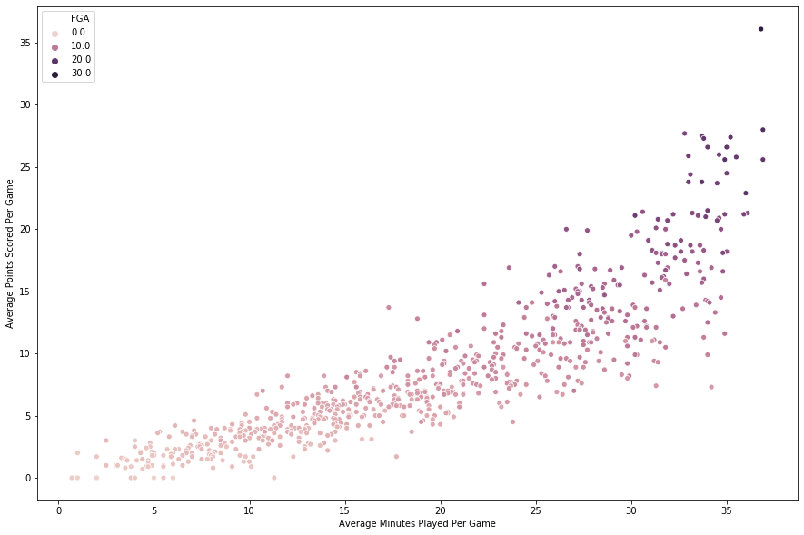


The above graph plots the average minutes played and average points scored for every player during the 2018-2019 season. Additionally, the hue of each circle represents how many field goals (2 or 3 point shots) per game that the player has attempted on average. The darker color the circle, then the more shots that player takes during games. This graph demonstrates that the more minutes a NBA player is alloted in a game, the more points they will most likely score. However, the point behind this graph was primarily to show that there are clearly groups of players who tend to be playing and scoring more than other players. The players in the upper/middle right of the graph are the ones we will be looking at in the next graph.

<center>
<h1 style="font-size:24px">Points Scored v. Minutes Played for Top 15 Scorers</h1>
</center>


```python
plt.figure(figsize=(15, 10))
# Get top 15 scorers
top_15 = nba_stats.head(15)
# Create a scatterplot of the average points scored and minutes played for top 15 scorers
ax = sns.scatterplot(x = 'MP', y = 'PTS', hue = 'FGA', data = top_15)

# Lable points with player's name associated with them
for line in range(0,top_15.shape[0]):
    plt.text(top_15.MP[line] + 0.05, top_15.PTS[line] + 0.05,
            top_15.Player[line], horizontalalignment = 'left',
            size = '10', color = 'black')

# Set up axis
ax.set_xlabel('Average Minutes Played Per Game')
ax.set_ylabel('Average Points Scored Per Game')
    
plt.show()
```


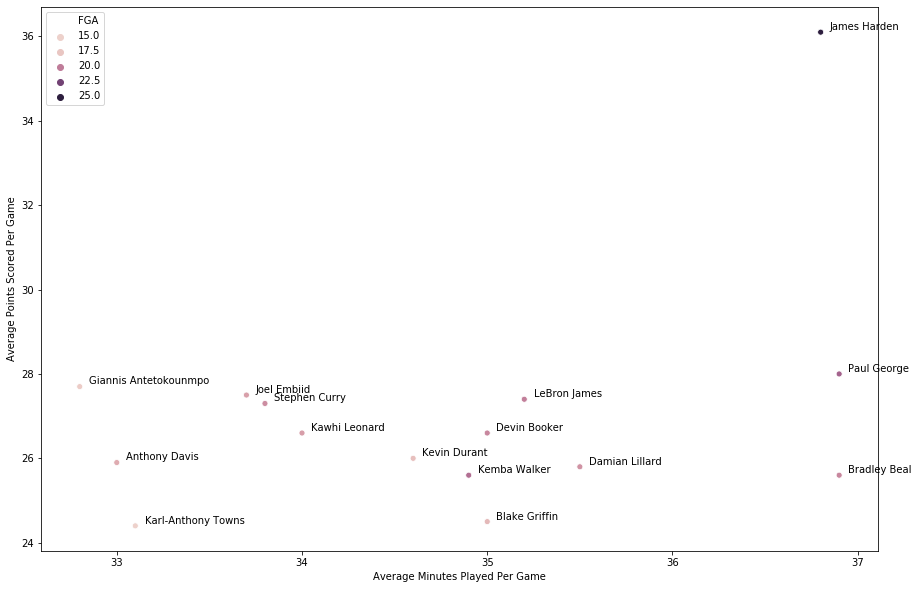


Just like the prior graph, this graph plots the average minutes played and average points scored by players during the 2018-2019 season. However, this graph focuses on only the top 15 players with the highest average points scored per game instead of every player. The hue of each circle still represents how many field goals per game on average that the player has attempted. It is important to note that FGA amount for each hue is different from the prior graph. It is also important to note that points and minutes played are not the only factor in selecting an MVP. Despite James Harden having such a large number of points last year per game, the MVP award was given to Giannis Antetokounmpo who had less points and less minutes played on average.

<center>
<h1 style="font-size:24px">Field Goals Attempted v. Field Goal Percentage For All NBA Players</h1>
</center>


```python
plt.figure(figsize=(15, 10))
# Create a scatterplot of the average field goals attempted vs field goal percentage for all scorers
ax = sns.scatterplot(x = 'FGA', y = 'FG%', data = nba_stats, color='deeppink')

# Set up axis
ax.set_xlabel('Average Field Goals Attempted Per Game')
ax.set_ylabel('Season Field Goal Percentage')

plt.show()
```


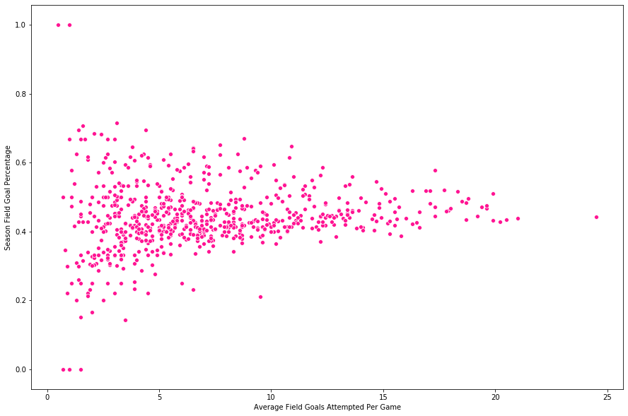


This graph is showing the average field goals attempted and field goal percentage for all players. Overall the graph shows no linear relationship between the two variables. The majority of players have a field goal percentage ranging from 35% to 55%. The majority of players also tend to attempt under 15 field goals on average.

<center>
<h1 style="font-size:24px">Field Goals Attempted v. Field Goal Percentage For Top 15 Scorers</h1>
</center>


```python
plt.figure(figsize=(15, 10))
# Create a scatterplot of the average field goals attempted vs field goal percentage for top 15 scorers
ax = sns.scatterplot(x = 'FGA', y = 'FG%', data = top_15, color='deeppink')

# Lable points with player's name associated with them
for line in range(0,top_15.shape[0]):
    plt.text(top_15['FGA'][line] + 0.05, top_15['FG%'][line],
            top_15['Player'][line], horizontalalignment = 'left',
            size = '10', color = 'black')
    
# Set up axis
ax.set_xlabel('Average Field Goals Attempted Per Game')
ax.set_ylabel('Season Field Goal Percentage')
    
plt.show()
```


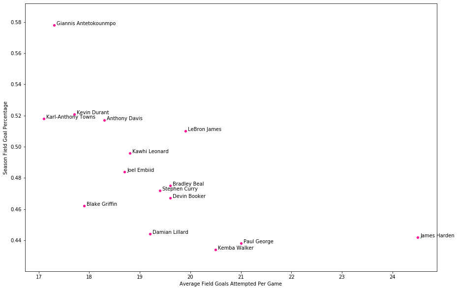


This graph is showing the average field goals attempted and field goal percentage for the top 15 scorers. In comparison to the prior graph, these players would be located towards the right side of the plot. These players have about the same field goal percentage range as the majority of NBA Players. Giannais Antetokounmpo, the previously discussed MVP winner, has the highest field goal percentage. James Harden has the most field goals attempted (and the most points scored as shown by the points scored and minutes played graph above), but he also has one of the lowest field goal percentage out of all of these top scorers.

<center>
<h1 style="font-size:24px">Total Rebounds v. Minutes Played For All NBA Players</h1>
</center>


```python
plt.figure(figsize=(15, 10))
# Create a scatterplot of the average total rebounds vs average minutes played for top all scorers
ax = sns.scatterplot(x = 'MP', y = 'TRB', data = nba_stats, color='orange')

# Set up axis
ax.set_xlabel('Average Minutes Played')
ax.set_ylabel('Average Total Rebounds')

plt.show()
```


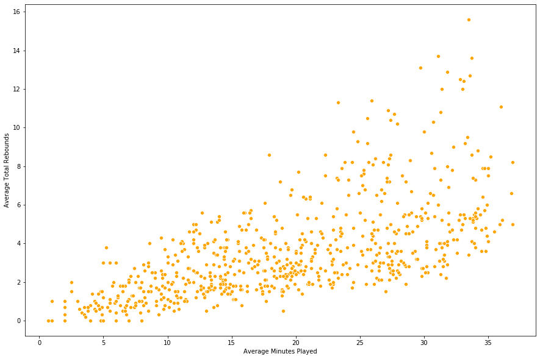


This graph is showing the average total rebounds and average minutes played for top all players. The graph depicts how this tends to be a linear relationship showing that as minutes played increases so does total rebounds. 

<center>
<h1 style="font-size:24px">Total Rebounds v. Minutes Played For Top 15 Scorers</h1>
</center>


```python
plt.figure(figsize=(15, 10))
# Create a scatterplot of the average total rebounds vs average minutes played for top 15 scorers
ax = sns.scatterplot(x = 'MP', y = 'TRB', data = top_15, color='orange')

# Lable points with player's name associated with them
for line in range(0,top_15.shape[0]):
    plt.text(top_15['MP'][line] + 0.05, top_15['TRB'][line],
            top_15['Player'][line], horizontalalignment = 'left',
            size = '10', color = 'black')
    
# Set up axis
ax.set_xlabel('Average Minutes Played')
ax.set_ylabel('Average Total Rebounds')

plt.show()
```


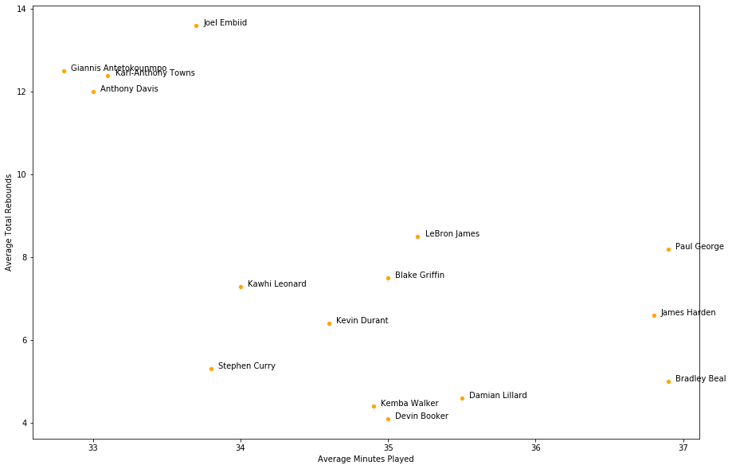


This graph shows the average total rebounds and average minutes played for top 15 scorers

<center>
<h1 style="font-size:24px">Total Assists v. Minutes Played For All NBA Players</h1>
</center>


```python
plt.figure(figsize=(15, 10))
# Create a scatterplot of the average total assists vs average minutes played for all players
ax = sns.scatterplot(x = 'MP', y = 'AST', data = nba_stats, color='darkred')

# Set up axis
ax.set_xlabel('Average Minutes Played')
ax.set_ylabel('Average Total Assists')

plt.show()
```


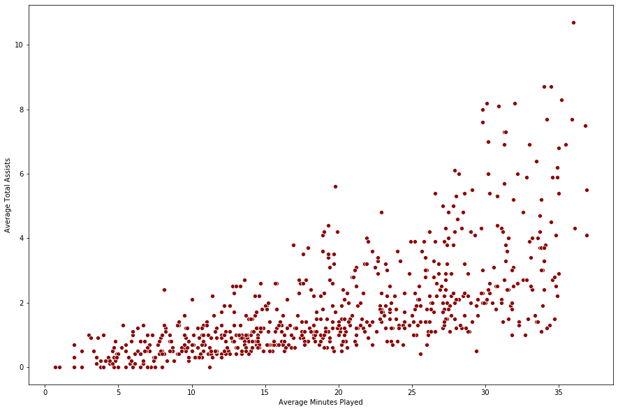


<center>
<h1 style="font-size:24px">Total Assists v. Minutes Played For Top 15 Scorers</h1>
</center>


```python
plt.figure(figsize=(15, 10))
# Create a scatterplot of the average total assits vs average minutes played for top 15 players
ax = sns.scatterplot(x = 'MP', y = 'AST', data = top_15, color='darkred')

# Lable points with player's name associated with them
for line in range(0,top_15.shape[0]):
    plt.text(top_15['MP'][line] + 0.05, top_15['AST'][line],
            top_15['Player'][line], horizontalalignment = 'left',
            size = '10', color = 'black')
    
# Set up axis
ax.set_xlabel('Average Minutes Played')
ax.set_ylabel('Average Total Assists')

plt.show()
```


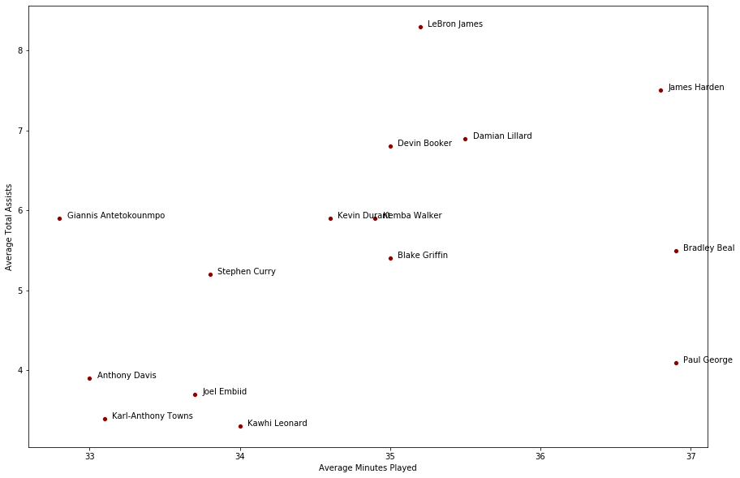


<center>
<h1 style="font-size:24px">Total Steals v. Minutes Played For All NBA Players</h1>
</center>


```python
plt.figure(figsize=(15, 10))
# Create a scatterplot of the average total steals vs average minutes played for all players
ax = sns.scatterplot(x = 'MP', y = 'STL', data = nba_stats, color='indigo')

# Set up axis
ax.set_xlabel('Average Minutes Played')
ax.set_ylabel('Average Total Assists')

plt.show()
```


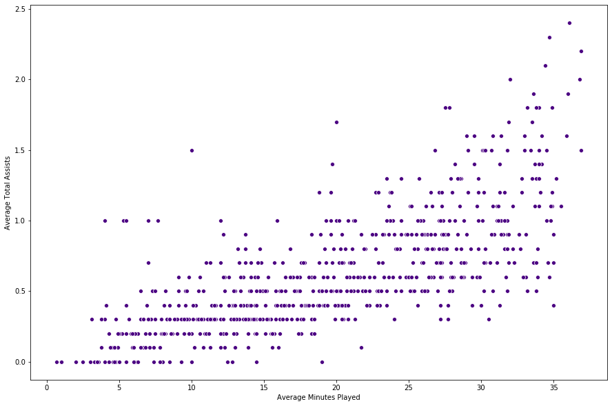


<center>
<h1 style="font-size:24px">Total Steals v. Minutes Played For Top 15 Scorers</h1>
</center>


```python
plt.figure(figsize=(15, 10))
# Create a scatterplot of the average total steals vs average minutes played for top 15 players
ax = sns.scatterplot(x = 'MP', y = 'STL', data = top_15, color='indigo')

# Lable points with player's name associated with them
for line in range(0,top_15.shape[0]):
    plt.text(top_15['MP'][line] + 0.05, top_15['STL'][line],
            top_15['Player'][line], horizontalalignment = 'left',
            size = '10', color = 'black')
    
# Set up axis
ax.set_xlabel('Average Minutes Played')
ax.set_ylabel('Average Total Steals')

plt.show()
```


<center>
<h1 style="font-size:24px"> Free Throw Percentage v. Free Throw Attempts For All NBA Players</h1>
</center>


```python
plt.figure(figsize=(15, 10))
# Create a scatterplot of the average free throw percentage vs average free throw attempts for all players
ax = sns.scatterplot(x = 'FTA', y = 'FT%', data = nba_stats, color='blue')

# Set up axis
ax.set_xlabel('Average Free Throws Attempted')
ax.set_ylabel('Average Free Throw Percentage')

plt.show()
```


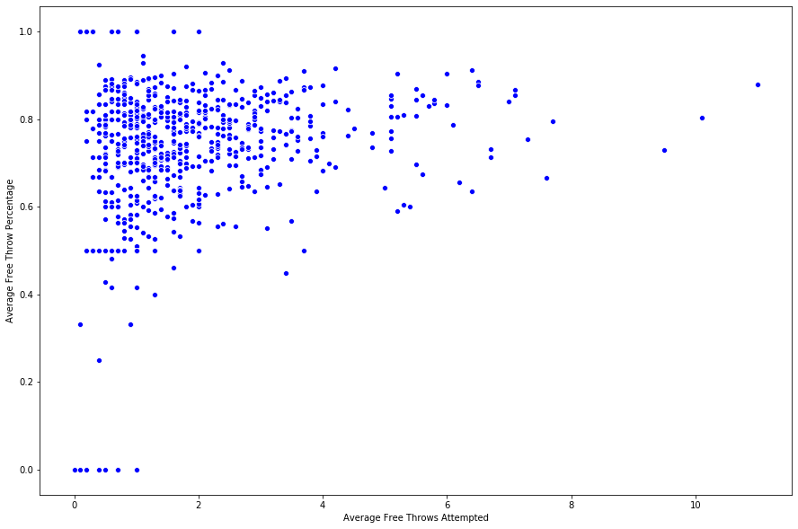


<center>
<h1 style="font-size:24px"> Free Throw Percentage v. Free Throw Attempts For Top 15 Scorers</h1>
</center>


```python
plt.figure(figsize=(15, 10))
# Create a scatterplot of the average free throw percentage vs average free throw attempts for top 15 players
ax = sns.scatterplot(x = 'FTA', y = 'FT%', data = top_15, color='blue')

# Lable points with player's name associated with them
for line in range(0,top_15.shape[0]):
    plt.text(top_15['FTA'][line] + 0.05, top_15['FT%'][line],
            top_15['Player'][line], horizontalalignment = 'left',
            size = '10', color = 'black')

# Set up axis
ax.set_xlabel('Average Free Throws Attempted')
ax.set_ylabel('Average Free Throw Percentage')

plt.show()
```


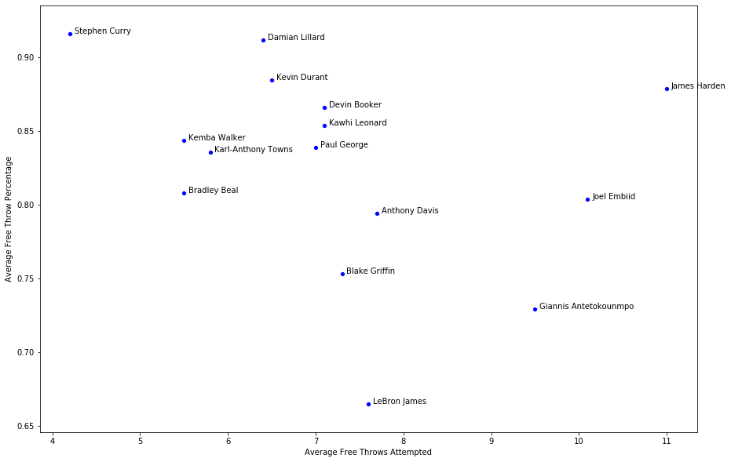


<center>
<h1 style="font-size:24px"> Player Efficiency Rating v. Player For Top 15 Scorers</h1>
</center>


```python
plt.figure(figsize=(15, 10))
# Get top 15 players
top_15 = nba_stats.head(15)
# Order top 15 players by player efficiency rating in decending order
top_15 = top_15.sort_values(by=['PER'], ascending=False)
# Create a barplot of the player efficiency rating for the top 15 players
ax = sns.barplot(x = 'Player', y = 'PER', data = top_15)

# Set up axis
ax.set_xlabel('Player')
ax.set_ylabel('Player Efficiency Rating')

# Make x axis lables vertical
plt.xticks(rotation='vertical')

plt.show()
```


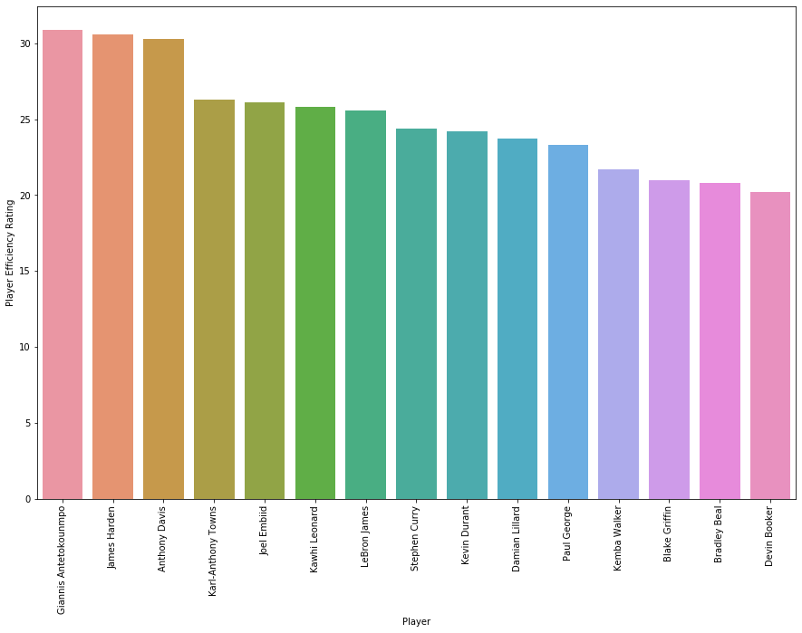


<center>
<h1 style="font-size:24px"> Box Plus/Minus v. Player For Top 15 Scorers</h1>
</center>


```python
plt.figure(figsize=(15, 10))
# Get top 15 players
top_15 = nba_stats.head(15)
# Order top 15 players by box plus/minus in decending order
top_15 = top_15.sort_values(by=['BPM'], ascending=False)
# Create a barplot of the box plus/minus for the top 15 players
ax = sns.barplot(x = 'Player', y = 'BPM', data = top_15)

# Set up axis
ax.set_xlabel('Player')
ax.set_ylabel('Box Plus/Minus')

# Make x axis lables vertical
plt.xticks(rotation='vertical')

plt.show()
```


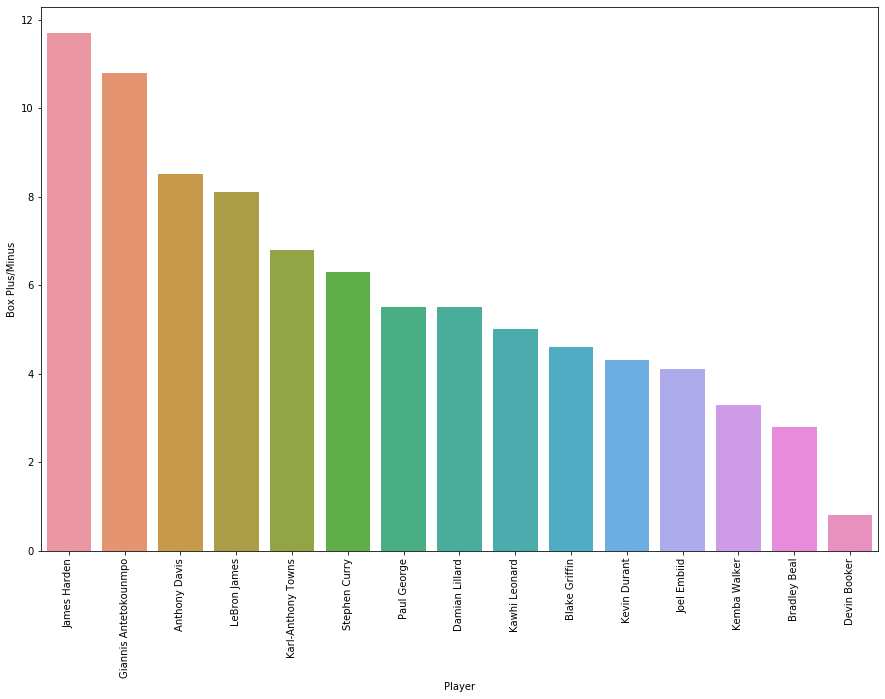


<center>
<h1 style="font-size:24px"> Value Over Replacement Player v. Player For Top 15 Scorers</h1>
</center>


```python
plt.figure(figsize=(15, 10))
# Get top 15 players
top_15 = nba_stats.head(15)
# Order top 15 players by value over replacement player in decending order
top_15 = top_15.sort_values(by=['VORP'], ascending=False)
# Create a barplot of the value over replacement player for the top 15 players
ax = sns.barplot(x = 'Player', y = 'VORP', data = top_15)

# Set up axis
ax.set_xlabel('Player')
ax.set_ylabel('Value Over Replacement Player')

# Make x axis lables vertical
plt.xticks(rotation='vertical')

plt.show()
```


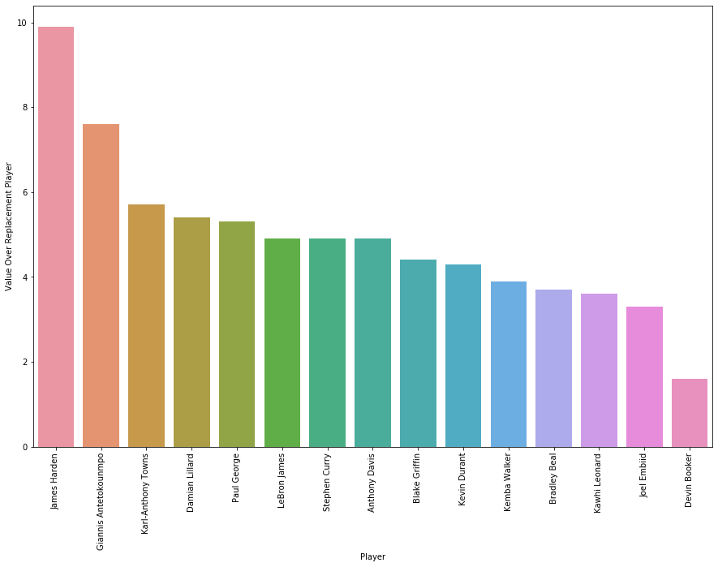


<center>
<h1 style="font-size:24px"> Win Shares v. Player For Top 15 Scorers</h1>
</center>


```python
plt.figure(figsize=(15, 10))
# Get top 15 players
top_15 = nba_stats.head(15)
# Order top 15 players by win shares in decending order
top_15 = top_15.sort_values(by=['WS'], ascending=False)
# Create a barplot of the win shares for the top 15 players
ax = sns.barplot(x = 'Player', y = 'WS', data = top_15)

# Set up axis
ax.set_xlabel('Player')
ax.set_ylabel('Win Shares')

# Make x axis lables vertical
plt.xticks(rotation='vertical')

plt.show()
```


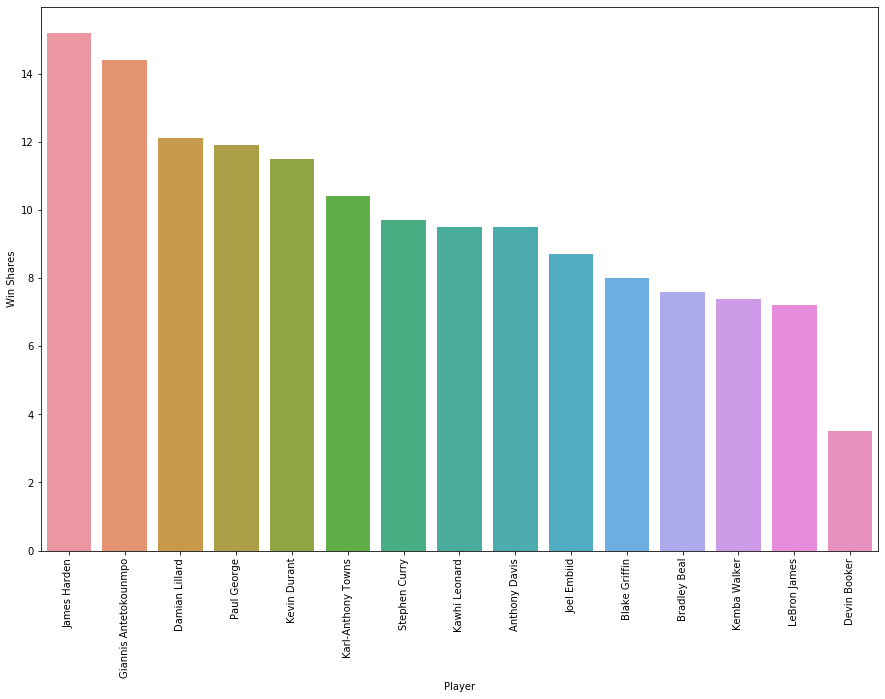


<center>
<h1 style="font-size:24px"> Win Percentage v. Player For Top 15 Scorers</h1>
</center>


```python
plt.figure(figsize=(15, 10))
# Get top 15 players
top_15 = nba_stats.head(15)
# Order top 15 players by win shares in decending order
top_15 = top_15.sort_values(by=['W%'], ascending=False)
# Create a barplot of the win shares for the top 15 players
ax = sns.barplot(x = 'Player', y = 'W%', data = top_15)

# Set up axis
ax.set_xlabel('Player')
ax.set_ylabel('Win Percentage')

# Make x axis lables vertical
plt.xticks(rotation='vertical')

plt.show()
```


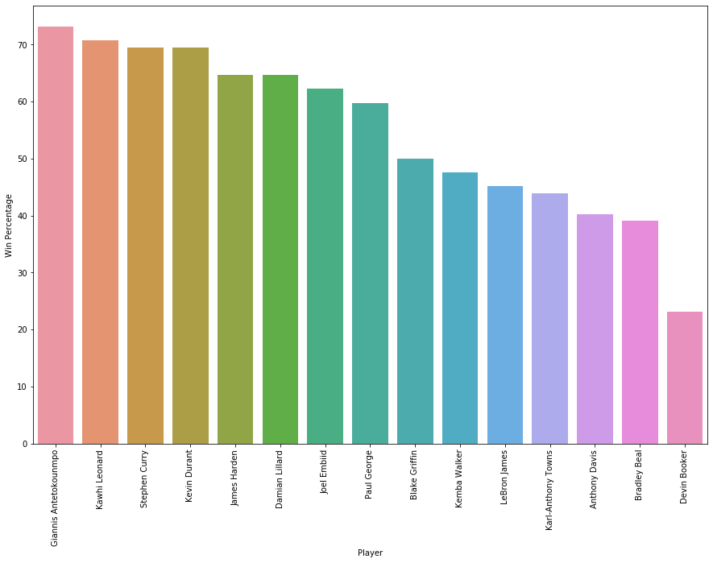


<center>
<h1 style="font-size:28px">Predicting the Most Valuable Player Award</h1>
</center>

<center>
<h1 style="font-size:24px">Getting the Current Season Data</h1>
</center>

We will be predicting the most valuable player for the current ongoing season (2019-2020) season. In order to do this we will need to get the player data for the current statistics this season. The data was taken from basketball-reference and can be found <a href="https://www.basketball-reference.com/leagues/NBA_2020_per_game.html">here</a>. Similar to before we also merged this in with data on advanced statistics which were also from basketball-reference and can be found <a href="https://www.basketball-reference.com/leagues/NBA_2020_advanced.html">here</a>. This data will be used on our model to predict the voting shares for each prospective mvp, which will be explained more later.


```python
# So for the machine larning parts of the project I was thinking we could take the current stats of players and 
# predict who would win all the above awards this year 
curr_stats = pd.read_csv("19_20_nba_stats.csv")
curr_stats_advanced = pd.read_csv("19_20_stats_advanced.csv")
clean_name_column(curr_stats)
clean_name_column(curr_stats_advanced)

curr_stats = curr_stats.drop(columns = ["Rk"])
curr_stats_advanced = curr_stats_advanced.drop(columns = ["Rk"])

# Merge the per game and advanced player statistics together. Drops any duplicate columns.
curr_stats = curr_stats.merge(right = curr_stats_advanced, how = 'outer', on = "Player", suffixes = ('', '_repeat'))

# Drop any repeated columns (they end in _repeat)
curr_stats = curr_stats[curr_stats.columns.drop(list(curr_stats.filter(regex='_repeat')))]

# Sort the dataframe by points
curr_stats = curr_stats.sort_values(by="PTS", ascending = False)

curr_stats = curr_stats.reset_index()
curr_stats = curr_stats.drop(columns = ["index"])

curr_stats.head(20)
```


<div>
<style scoped>
    .dataframe tbody tr th:only-of-type {
        vertical-align: middle;
    }

    .dataframe tbody tr th {
        vertical-align: top;
    }

    .dataframe thead th {
        text-align: right;
    }
</style>
<table border="1" class="dataframe">
  <thead>
    <tr style="text-align: right;">
      <th></th>
      <th>Player</th>
      <th>Pos</th>
      <th>Age</th>
      <th>Tm</th>
      <th>G</th>
      <th>GS</th>
      <th>MP</th>
      <th>FG</th>
      <th>FGA</th>
      <th>FG%</th>
      <th>3P</th>
      <th>3PA</th>
      <th>3P%</th>
      <th>2P</th>
      <th>2PA</th>
      <th>2P%</th>
      <th>eFG%</th>
      <th>FT</th>
      <th>FTA</th>
      <th>FT%</th>
      <th>ORB</th>
      <th>DRB</th>
      <th>TRB</th>
      <th>AST</th>
      <th>STL</th>
      <th>BLK</th>
      <th>TOV</th>
      <th>PF</th>
      <th>PTS</th>
      <th>PER</th>
      <th>TS%</th>
      <th>3PAr</th>
      <th>FTr</th>
      <th>ORB%</th>
      <th>DRB%</th>
      <th>TRB%</th>
      <th>AST%</th>
      <th>STL%</th>
      <th>BLK%</th>
      <th>TOV%</th>
      <th>USG%</th>
      <th>OWS</th>
      <th>DWS</th>
      <th>WS</th>
      <th>WS/48</th>
      <th>OBPM</th>
      <th>DBPM</th>
      <th>BPM</th>
      <th>VORP</th>
    </tr>
  </thead>
  <tbody>
    <tr>
      <th>0</th>
      <td>James Harden</td>
      <td>SG</td>
      <td>30.0</td>
      <td>HOU</td>
      <td>23.0</td>
      <td>23.0</td>
      <td>37.7</td>
      <td>10.3</td>
      <td>24.0</td>
      <td>0.431</td>
      <td>4.7</td>
      <td>13.8</td>
      <td>0.338</td>
      <td>5.7</td>
      <td>10.2</td>
      <td>0.557</td>
      <td>0.528</td>
      <td>12.6</td>
      <td>14.3</td>
      <td>0.879</td>
      <td>1.0</td>
      <td>5.1</td>
      <td>6.0</td>
      <td>7.5</td>
      <td>2.0</td>
      <td>0.6</td>
      <td>5.1</td>
      <td>3.3</td>
      <td>38.0</td>
      <td>31.1</td>
      <td>0.633</td>
      <td>0.572</td>
      <td>0.572</td>
      <td>2.5</td>
      <td>13.5</td>
      <td>8.1</td>
      <td>35.4</td>
      <td>2.4</td>
      <td>1.4</td>
      <td>14.4</td>
      <td>38.2</td>
      <td>4.5</td>
      <td>1.0</td>
      <td>5.5</td>
      <td>0.291</td>
      <td>10.6</td>
      <td>-0.5</td>
      <td>10.1</td>
      <td>2.8</td>
    </tr>
    <tr>
      <th>1</th>
      <td>Giannis Antetokounmpo</td>
      <td>PF</td>
      <td>25.0</td>
      <td>MIL</td>
      <td>24.0</td>
      <td>24.0</td>
      <td>31.6</td>
      <td>11.5</td>
      <td>20.3</td>
      <td>0.564</td>
      <td>1.6</td>
      <td>5.0</td>
      <td>0.319</td>
      <td>9.9</td>
      <td>15.4</td>
      <td>0.642</td>
      <td>0.602</td>
      <td>6.4</td>
      <td>10.8</td>
      <td>0.588</td>
      <td>2.7</td>
      <td>10.5</td>
      <td>13.2</td>
      <td>5.5</td>
      <td>1.3</td>
      <td>1.3</td>
      <td>3.8</td>
      <td>3.2</td>
      <td>30.9</td>
      <td>33.7</td>
      <td>0.615</td>
      <td>0.244</td>
      <td>0.533</td>
      <td>9.0</td>
      <td>31.2</td>
      <td>20.7</td>
      <td>31.6</td>
      <td>1.9</td>
      <td>3.6</td>
      <td>13.1</td>
      <td>37.6</td>
      <td>2.9</td>
      <td>2.0</td>
      <td>4.9</td>
      <td>0.309</td>
      <td>7.5</td>
      <td>5.1</td>
      <td>12.6</td>
      <td>2.8</td>
    </tr>
    <tr>
      <th>2</th>
      <td>Luka Dončić</td>
      <td>PG</td>
      <td>20.0</td>
      <td>DAL</td>
      <td>23.0</td>
      <td>23.0</td>
      <td>33.4</td>
      <td>9.7</td>
      <td>20.3</td>
      <td>0.476</td>
      <td>3.0</td>
      <td>9.5</td>
      <td>0.320</td>
      <td>6.6</td>
      <td>10.7</td>
      <td>0.615</td>
      <td>0.552</td>
      <td>7.6</td>
      <td>9.3</td>
      <td>0.814</td>
      <td>1.3</td>
      <td>8.5</td>
      <td>9.8</td>
      <td>9.2</td>
      <td>1.3</td>
      <td>0.1</td>
      <td>4.6</td>
      <td>2.4</td>
      <td>30.0</td>
      <td>32.1</td>
      <td>0.619</td>
      <td>0.473</td>
      <td>0.463</td>
      <td>4.3</td>
      <td>25.9</td>
      <td>15.5</td>
      <td>48.0</td>
      <td>1.8</td>
      <td>0.3</td>
      <td>15.5</td>
      <td>36.9</td>
      <td>3.9</td>
      <td>1.2</td>
      <td>5.0</td>
      <td>0.301</td>
      <td>11.2</td>
      <td>2.4</td>
      <td>13.7</td>
      <td>3.2</td>
    </tr>
    <tr>
      <th>3</th>
      <td>Trae Young</td>
      <td>PG</td>
      <td>21.0</td>
      <td>ATL</td>
      <td>22.0</td>
      <td>22.0</td>
      <td>34.6</td>
      <td>9.5</td>
      <td>20.5</td>
      <td>0.462</td>
      <td>3.5</td>
      <td>8.9</td>
      <td>0.388</td>
      <td>6.0</td>
      <td>11.5</td>
      <td>0.520</td>
      <td>0.547</td>
      <td>6.4</td>
      <td>7.5</td>
      <td>0.860</td>
      <td>0.5</td>
      <td>3.6</td>
      <td>4.1</td>
      <td>8.4</td>
      <td>1.3</td>
      <td>0.0</td>
      <td>4.9</td>
      <td>1.3</td>
      <td>28.8</td>
      <td>23.4</td>
      <td>0.597</td>
      <td>0.441</td>
      <td>0.364</td>
      <td>1.5</td>
      <td>11.5</td>
      <td>6.5</td>
      <td>43.8</td>
      <td>1.7</td>
      <td>0.1</td>
      <td>17.5</td>
      <td>34.0</td>
      <td>1.9</td>
      <td>0.0</td>
      <td>2.0</td>
      <td>0.114</td>
      <td>6.9</td>
      <td>-3.3</td>
      <td>3.5</td>
      <td>1.2</td>
    </tr>
    <tr>
      <th>4</th>
      <td>Bradley Beal</td>
      <td>SG</td>
      <td>26.0</td>
      <td>WAS</td>
      <td>22.0</td>
      <td>22.0</td>
      <td>37.0</td>
      <td>9.6</td>
      <td>21.3</td>
      <td>0.453</td>
      <td>2.6</td>
      <td>7.7</td>
      <td>0.343</td>
      <td>7.0</td>
      <td>13.6</td>
      <td>0.515</td>
      <td>0.515</td>
      <td>6.0</td>
      <td>7.2</td>
      <td>0.836</td>
      <td>1.0</td>
      <td>3.5</td>
      <td>4.5</td>
      <td>7.0</td>
      <td>1.0</td>
      <td>0.2</td>
      <td>3.5</td>
      <td>2.7</td>
      <td>28.0</td>
      <td>20.2</td>
      <td>0.564</td>
      <td>0.361</td>
      <td>0.337</td>
      <td>2.9</td>
      <td>10.7</td>
      <td>6.7</td>
      <td>28.8</td>
      <td>1.1</td>
      <td>0.6</td>
      <td>12.7</td>
      <td>31.0</td>
      <td>1.7</td>
      <td>-0.2</td>
      <td>1.5</td>
      <td>0.087</td>
      <td>3.8</td>
      <td>-3.3</td>
      <td>0.5</td>
      <td>0.5</td>
    </tr>
    <tr>
      <th>5</th>
      <td>Anthony Davis</td>
      <td>PF</td>
      <td>26.0</td>
      <td>LAL</td>
      <td>23.0</td>
      <td>23.0</td>
      <td>34.4</td>
      <td>9.7</td>
      <td>19.0</td>
      <td>0.507</td>
      <td>1.1</td>
      <td>3.3</td>
      <td>0.333</td>
      <td>8.6</td>
      <td>15.8</td>
      <td>0.543</td>
      <td>0.535</td>
      <td>7.3</td>
      <td>8.3</td>
      <td>0.870</td>
      <td>2.4</td>
      <td>6.6</td>
      <td>9.0</td>
      <td>3.3</td>
      <td>1.5</td>
      <td>2.7</td>
      <td>2.3</td>
      <td>2.3</td>
      <td>27.7</td>
      <td>29.8</td>
      <td>0.599</td>
      <td>0.172</td>
      <td>0.428</td>
      <td>8.3</td>
      <td>20.8</td>
      <td>14.7</td>
      <td>15.8</td>
      <td>2.1</td>
      <td>6.8</td>
      <td>9.0</td>
      <td>30.8</td>
      <td>3.0</td>
      <td>1.9</td>
      <td>5.0</td>
      <td>0.288</td>
      <td>3.6</td>
      <td>4.0</td>
      <td>7.6</td>
      <td>2.0</td>
    </tr>
    <tr>
      <th>6</th>
      <td>Damian Lillard</td>
      <td>PG</td>
      <td>29.0</td>
      <td>POR</td>
      <td>22.0</td>
      <td>22.0</td>
      <td>36.9</td>
      <td>8.3</td>
      <td>18.7</td>
      <td>0.443</td>
      <td>3.1</td>
      <td>9.0</td>
      <td>0.350</td>
      <td>5.1</td>
      <td>9.7</td>
      <td>0.528</td>
      <td>0.527</td>
      <td>7.0</td>
      <td>7.7</td>
      <td>0.911</td>
      <td>0.5</td>
      <td>4.1</td>
      <td>4.6</td>
      <td>7.4</td>
      <td>1.0</td>
      <td>0.5</td>
      <td>2.9</td>
      <td>2.0</td>
      <td>26.7</td>
      <td>24.5</td>
      <td>0.607</td>
      <td>0.493</td>
      <td>0.398</td>
      <td>1.4</td>
      <td>10.8</td>
      <td>6.1</td>
      <td>32.3</td>
      <td>1.3</td>
      <td>1.0</td>
      <td>11.6</td>
      <td>28.2</td>
      <td>3.3</td>
      <td>0.4</td>
      <td>3.7</td>
      <td>0.201</td>
      <td>7.4</td>
      <td>-2.3</td>
      <td>5.1</td>
      <td>1.6</td>
    </tr>
    <tr>
      <th>7</th>
      <td>Karl-Anthony Towns</td>
      <td>C</td>
      <td>24.0</td>
      <td>MIN</td>
      <td>21.0</td>
      <td>21.0</td>
      <td>33.7</td>
      <td>9.0</td>
      <td>17.4</td>
      <td>0.516</td>
      <td>3.6</td>
      <td>8.4</td>
      <td>0.424</td>
      <td>5.4</td>
      <td>9.0</td>
      <td>0.603</td>
      <td>0.619</td>
      <td>4.6</td>
      <td>5.7</td>
      <td>0.800</td>
      <td>2.6</td>
      <td>9.1</td>
      <td>11.7</td>
      <td>4.5</td>
      <td>1.0</td>
      <td>1.4</td>
      <td>3.0</td>
      <td>3.4</td>
      <td>26.1</td>
      <td>28.1</td>
      <td>0.651</td>
      <td>0.488</td>
      <td>0.339</td>
      <td>8.3</td>
      <td>27.8</td>
      <td>18.0</td>
      <td>23.0</td>
      <td>1.4</td>
      <td>3.1</td>
      <td>13.3</td>
      <td>27.9</td>
      <td>2.9</td>
      <td>0.8</td>
      <td>3.6</td>
      <td>0.235</td>
      <td>7.5</td>
      <td>1.3</td>
      <td>8.8</td>
      <td>2.0</td>
    </tr>
    <tr>
      <th>8</th>
      <td>LeBron James</td>
      <td>PG</td>
      <td>35.0</td>
      <td>LAL</td>
      <td>24.0</td>
      <td>24.0</td>
      <td>34.4</td>
      <td>10.0</td>
      <td>19.9</td>
      <td>0.501</td>
      <td>2.2</td>
      <td>6.0</td>
      <td>0.364</td>
      <td>7.8</td>
      <td>13.9</td>
      <td>0.560</td>
      <td>0.556</td>
      <td>3.8</td>
      <td>5.4</td>
      <td>0.705</td>
      <td>1.0</td>
      <td>5.9</td>
      <td>6.8</td>
      <td>10.8</td>
      <td>1.3</td>
      <td>0.5</td>
      <td>3.7</td>
      <td>1.8</td>
      <td>25.9</td>
      <td>27.3</td>
      <td>0.577</td>
      <td>0.297</td>
      <td>0.267</td>
      <td>3.3</td>
      <td>18.7</td>
      <td>11.2</td>
      <td>51.6</td>
      <td>1.8</td>
      <td>1.3</td>
      <td>14.5</td>
      <td>32.3</td>
      <td>2.9</td>
      <td>1.5</td>
      <td>4.4</td>
      <td>0.244</td>
      <td>7.2</td>
      <td>2.1</td>
      <td>9.3</td>
      <td>2.5</td>
    </tr>
    <tr>
      <th>9</th>
      <td>Devin Booker</td>
      <td>SG</td>
      <td>23.0</td>
      <td>PHO</td>
      <td>23.0</td>
      <td>23.0</td>
      <td>35.7</td>
      <td>9.0</td>
      <td>17.5</td>
      <td>0.514</td>
      <td>2.3</td>
      <td>5.7</td>
      <td>0.415</td>
      <td>6.7</td>
      <td>11.9</td>
      <td>0.560</td>
      <td>0.581</td>
      <td>5.1</td>
      <td>5.7</td>
      <td>0.908</td>
      <td>0.6</td>
      <td>3.3</td>
      <td>3.9</td>
      <td>6.3</td>
      <td>0.6</td>
      <td>0.3</td>
      <td>3.9</td>
      <td>3.1</td>
      <td>25.5</td>
      <td>19.9</td>
      <td>0.627</td>
      <td>0.317</td>
      <td>0.319</td>
      <td>1.8</td>
      <td>10.4</td>
      <td>6.0</td>
      <td>29.5</td>
      <td>0.8</td>
      <td>0.8</td>
      <td>16.0</td>
      <td>27.9</td>
      <td>2.0</td>
      <td>0.4</td>
      <td>2.4</td>
      <td>0.135</td>
      <td>3.6</td>
      <td>-1.9</td>
      <td>1.7</td>
      <td>0.8</td>
    </tr>
    <tr>
      <th>10</th>
      <td>Kawhi Leonard</td>
      <td>SF</td>
      <td>28.0</td>
      <td>LAC</td>
      <td>18.0</td>
      <td>18.0</td>
      <td>31.1</td>
      <td>8.9</td>
      <td>20.0</td>
      <td>0.447</td>
      <td>1.7</td>
      <td>5.1</td>
      <td>0.330</td>
      <td>7.3</td>
      <td>14.9</td>
      <td>0.487</td>
      <td>0.489</td>
      <td>5.5</td>
      <td>6.4</td>
      <td>0.853</td>
      <td>1.1</td>
      <td>6.8</td>
      <td>7.9</td>
      <td>5.2</td>
      <td>1.9</td>
      <td>0.8</td>
      <td>3.4</td>
      <td>2.0</td>
      <td>25.1</td>
      <td>25.0</td>
      <td>0.555</td>
      <td>0.254</td>
      <td>0.324</td>
      <td>3.5</td>
      <td>21.2</td>
      <td>12.6</td>
      <td>29.4</td>
      <td>2.8</td>
      <td>2.1</td>
      <td>13.0</td>
      <td>33.7</td>
      <td>1.1</td>
      <td>1.3</td>
      <td>2.3</td>
      <td>0.187</td>
      <td>3.2</td>
      <td>3.5</td>
      <td>6.7</td>
      <td>1.3</td>
    </tr>
    <tr>
      <th>11</th>
      <td>Brandon Ingram</td>
      <td>PF</td>
      <td>22.0</td>
      <td>NOP</td>
      <td>20.0</td>
      <td>20.0</td>
      <td>33.7</td>
      <td>9.0</td>
      <td>18.1</td>
      <td>0.494</td>
      <td>2.3</td>
      <td>5.5</td>
      <td>0.418</td>
      <td>6.7</td>
      <td>12.6</td>
      <td>0.528</td>
      <td>0.558</td>
      <td>4.7</td>
      <td>5.6</td>
      <td>0.839</td>
      <td>0.8</td>
      <td>6.2</td>
      <td>7.0</td>
      <td>4.0</td>
      <td>0.8</td>
      <td>0.9</td>
      <td>2.9</td>
      <td>3.0</td>
      <td>24.9</td>
      <td>21.2</td>
      <td>0.601</td>
      <td>0.313</td>
      <td>0.302</td>
      <td>2.5</td>
      <td>20.6</td>
      <td>11.2</td>
      <td>19.3</td>
      <td>1.0</td>
      <td>2.2</td>
      <td>12.5</td>
      <td>28.9</td>
      <td>1.4</td>
      <td>0.3</td>
      <td>1.7</td>
      <td>0.117</td>
      <td>2.3</td>
      <td>-0.9</td>
      <td>1.4</td>
      <td>0.6</td>
    </tr>
    <tr>
      <th>12</th>
      <td>Donovan Mitchell</td>
      <td>SG</td>
      <td>23.0</td>
      <td>UTA</td>
      <td>24.0</td>
      <td>24.0</td>
      <td>34.6</td>
      <td>9.0</td>
      <td>20.7</td>
      <td>0.438</td>
      <td>2.3</td>
      <td>6.2</td>
      <td>0.362</td>
      <td>6.8</td>
      <td>14.5</td>
      <td>0.470</td>
      <td>0.492</td>
      <td>4.3</td>
      <td>5.2</td>
      <td>0.839</td>
      <td>0.9</td>
      <td>3.9</td>
      <td>4.8</td>
      <td>3.6</td>
      <td>1.3</td>
      <td>0.3</td>
      <td>2.4</td>
      <td>2.2</td>
      <td>24.7</td>
      <td>19.7</td>
      <td>0.544</td>
      <td>0.298</td>
      <td>0.244</td>
      <td>2.8</td>
      <td>11.7</td>
      <td>7.4</td>
      <td>20.1</td>
      <td>1.7</td>
      <td>0.7</td>
      <td>9.4</td>
      <td>31.6</td>
      <td>1.1</td>
      <td>1.1</td>
      <td>2.2</td>
      <td>0.120</td>
      <td>1.8</td>
      <td>-0.5</td>
      <td>1.3</td>
      <td>0.7</td>
    </tr>
    <tr>
      <th>13</th>
      <td>Pascal Siakam</td>
      <td>PF</td>
      <td>25.0</td>
      <td>TOR</td>
      <td>23.0</td>
      <td>23.0</td>
      <td>36.9</td>
      <td>9.2</td>
      <td>20.0</td>
      <td>0.458</td>
      <td>2.3</td>
      <td>6.2</td>
      <td>0.364</td>
      <td>6.9</td>
      <td>13.8</td>
      <td>0.500</td>
      <td>0.514</td>
      <td>3.9</td>
      <td>4.8</td>
      <td>0.811</td>
      <td>1.6</td>
      <td>6.9</td>
      <td>8.4</td>
      <td>3.6</td>
      <td>0.9</td>
      <td>0.7</td>
      <td>2.7</td>
      <td>2.7</td>
      <td>24.5</td>
      <td>18.7</td>
      <td>0.553</td>
      <td>0.306</td>
      <td>0.241</td>
      <td>4.4</td>
      <td>17.9</td>
      <td>11.4</td>
      <td>17.0</td>
      <td>1.2</td>
      <td>2.0</td>
      <td>11.0</td>
      <td>28.8</td>
      <td>1.0</td>
      <td>1.4</td>
      <td>2.4</td>
      <td>0.131</td>
      <td>1.1</td>
      <td>0.7</td>
      <td>1.8</td>
      <td>0.8</td>
    </tr>
    <tr>
      <th>14</th>
      <td>Andrew Wiggins</td>
      <td>SF</td>
      <td>24.0</td>
      <td>MIN</td>
      <td>19.0</td>
      <td>19.0</td>
      <td>34.6</td>
      <td>9.2</td>
      <td>20.2</td>
      <td>0.453</td>
      <td>2.2</td>
      <td>6.5</td>
      <td>0.333</td>
      <td>7.0</td>
      <td>13.7</td>
      <td>0.510</td>
      <td>0.507</td>
      <td>4.0</td>
      <td>5.5</td>
      <td>0.724</td>
      <td>1.2</td>
      <td>3.9</td>
      <td>5.2</td>
      <td>3.4</td>
      <td>0.6</td>
      <td>1.3</td>
      <td>1.9</td>
      <td>2.4</td>
      <td>24.5</td>
      <td>19.6</td>
      <td>0.541</td>
      <td>0.322</td>
      <td>0.260</td>
      <td>3.8</td>
      <td>11.9</td>
      <td>7.8</td>
      <td>16.9</td>
      <td>0.9</td>
      <td>2.8</td>
      <td>7.9</td>
      <td>29.2</td>
      <td>1.1</td>
      <td>0.3</td>
      <td>1.3</td>
      <td>0.092</td>
      <td>1.4</td>
      <td>-2.0</td>
      <td>-0.5</td>
      <td>0.3</td>
    </tr>
    <tr>
      <th>15</th>
      <td>Russell Westbrook</td>
      <td>PG</td>
      <td>31.0</td>
      <td>HOU</td>
      <td>21.0</td>
      <td>21.0</td>
      <td>34.4</td>
      <td>8.3</td>
      <td>19.8</td>
      <td>0.421</td>
      <td>1.2</td>
      <td>5.2</td>
      <td>0.229</td>
      <td>7.1</td>
      <td>14.6</td>
      <td>0.489</td>
      <td>0.451</td>
      <td>4.6</td>
      <td>6.1</td>
      <td>0.744</td>
      <td>1.6</td>
      <td>6.5</td>
      <td>8.1</td>
      <td>7.5</td>
      <td>1.6</td>
      <td>0.4</td>
      <td>4.6</td>
      <td>4.0</td>
      <td>22.4</td>
      <td>18.0</td>
      <td>0.499</td>
      <td>0.259</td>
      <td>0.305</td>
      <td>4.9</td>
      <td>19.0</td>
      <td>12.0</td>
      <td>35.7</td>
      <td>2.3</td>
      <td>0.9</td>
      <td>16.5</td>
      <td>31.7</td>
      <td>0.3</td>
      <td>0.9</td>
      <td>1.3</td>
      <td>0.080</td>
      <td>-0.4</td>
      <td>1.2</td>
      <td>0.8</td>
      <td>0.5</td>
    </tr>
    <tr>
      <th>16</th>
      <td>Zach LaVine</td>
      <td>SG</td>
      <td>24.0</td>
      <td>CHI</td>
      <td>25.0</td>
      <td>25.0</td>
      <td>32.8</td>
      <td>7.6</td>
      <td>17.8</td>
      <td>0.425</td>
      <td>3.0</td>
      <td>7.5</td>
      <td>0.396</td>
      <td>4.6</td>
      <td>10.3</td>
      <td>0.446</td>
      <td>0.508</td>
      <td>4.2</td>
      <td>5.2</td>
      <td>0.800</td>
      <td>0.7</td>
      <td>3.8</td>
      <td>4.5</td>
      <td>4.0</td>
      <td>1.2</td>
      <td>0.5</td>
      <td>3.4</td>
      <td>2.5</td>
      <td>22.2</td>
      <td>18.1</td>
      <td>0.568</td>
      <td>0.421</td>
      <td>0.291</td>
      <td>2.1</td>
      <td>12.6</td>
      <td>7.1</td>
      <td>22.0</td>
      <td>1.8</td>
      <td>1.4</td>
      <td>14.5</td>
      <td>30.2</td>
      <td>0.6</td>
      <td>1.0</td>
      <td>1.7</td>
      <td>0.094</td>
      <td>1.8</td>
      <td>-0.5</td>
      <td>1.3</td>
      <td>0.7</td>
    </tr>
    <tr>
      <th>17</th>
      <td>CJ McCollum</td>
      <td>SG</td>
      <td>28.0</td>
      <td>POR</td>
      <td>24.0</td>
      <td>24.0</td>
      <td>36.4</td>
      <td>8.8</td>
      <td>19.8</td>
      <td>0.447</td>
      <td>2.6</td>
      <td>6.8</td>
      <td>0.387</td>
      <td>6.2</td>
      <td>13.0</td>
      <td>0.479</td>
      <td>0.514</td>
      <td>1.7</td>
      <td>2.1</td>
      <td>0.804</td>
      <td>0.8</td>
      <td>3.6</td>
      <td>4.5</td>
      <td>3.8</td>
      <td>0.8</td>
      <td>0.9</td>
      <td>1.9</td>
      <td>2.8</td>
      <td>22.0</td>
      <td>16.1</td>
      <td>0.532</td>
      <td>0.357</td>
      <td>0.108</td>
      <td>2.2</td>
      <td>10.0</td>
      <td>6.1</td>
      <td>16.3</td>
      <td>1.0</td>
      <td>2.0</td>
      <td>8.9</td>
      <td>25.7</td>
      <td>0.9</td>
      <td>0.4</td>
      <td>1.3</td>
      <td>0.065</td>
      <td>1.2</td>
      <td>-1.7</td>
      <td>-0.6</td>
      <td>0.3</td>
    </tr>
    <tr>
      <th>18</th>
      <td>Joel Embiid</td>
      <td>C</td>
      <td>25.0</td>
      <td>PHI</td>
      <td>19.0</td>
      <td>19.0</td>
      <td>30.4</td>
      <td>7.0</td>
      <td>15.3</td>
      <td>0.459</td>
      <td>1.1</td>
      <td>3.5</td>
      <td>0.313</td>
      <td>5.9</td>
      <td>11.7</td>
      <td>0.502</td>
      <td>0.495</td>
      <td>6.8</td>
      <td>8.5</td>
      <td>0.807</td>
      <td>2.5</td>
      <td>9.9</td>
      <td>12.5</td>
      <td>2.9</td>
      <td>0.9</td>
      <td>1.4</td>
      <td>3.4</td>
      <td>3.5</td>
      <td>21.9</td>
      <td>24.7</td>
      <td>0.583</td>
      <td>0.222</td>
      <td>0.553</td>
      <td>9.5</td>
      <td>35.0</td>
      <td>22.8</td>
      <td>17.3</td>
      <td>1.4</td>
      <td>3.7</td>
      <td>14.6</td>
      <td>31.9</td>
      <td>1.3</td>
      <td>1.4</td>
      <td>2.7</td>
      <td>0.205</td>
      <td>0.9</td>
      <td>2.7</td>
      <td>3.5</td>
      <td>0.9</td>
    </tr>
    <tr>
      <th>19</th>
      <td>Kemba Walker</td>
      <td>PG</td>
      <td>29.0</td>
      <td>BOS</td>
      <td>21.0</td>
      <td>21.0</td>
      <td>32.0</td>
      <td>7.1</td>
      <td>17.0</td>
      <td>0.420</td>
      <td>3.6</td>
      <td>8.9</td>
      <td>0.403</td>
      <td>3.6</td>
      <td>8.1</td>
      <td>0.439</td>
      <td>0.525</td>
      <td>4.0</td>
      <td>4.3</td>
      <td>0.912</td>
      <td>1.0</td>
      <td>3.4</td>
      <td>4.4</td>
      <td>5.1</td>
      <td>1.0</td>
      <td>0.6</td>
      <td>2.2</td>
      <td>1.7</td>
      <td>21.8</td>
      <td>23.3</td>
      <td>0.585</td>
      <td>0.527</td>
      <td>0.266</td>
      <td>3.0</td>
      <td>10.8</td>
      <td>6.9</td>
      <td>27.2</td>
      <td>1.4</td>
      <td>1.6</td>
      <td>9.8</td>
      <td>29.1</td>
      <td>2.3</td>
      <td>0.9</td>
      <td>3.2</td>
      <td>0.206</td>
      <td>6.4</td>
      <td>-1.0</td>
      <td>5.3</td>
      <td>1.4</td>
    </tr>
  </tbody>
</table>
</div>


<center>
<h1 style="font-size:24px">Getting the Historical Data</h1>
</center>

In order to predict who will win the MVP we will need to predict the voting shares for each of the prospective winners. We will be using historical data from the 1997-1998 MVP voting to train our model on. We decided to take this season as our training data instead of the 2018-2019 season because we did not want any players to overlap between the two voting periods. The voting data for the 1997-1998 season was taken from basketball-reference and can be found <a href="https://www.basketball-reference.com/awards/awards_1998.html">here</a>. After getting this data we got merged it with an addiotional dataset of the advanced stats for the players of the 1997-1998 season which can be found <a href="https://www.basketball-reference.com/leagues/NBA_1998_advanced.html">here</a>. We merged in this dataset as we will be using some of these advanced stats in our model.


```python
# Importing the historical data 
past_mvp_voting = pd.read_csv('historic_mvp_voting.csv')
historical_data_advanced = pd.read_csv('97_98_advanced_stats.csv')
clean_name_column(historical_data_advanced)
clean_name_column(past_mvp_voting)
for i,row in historical_data_advanced.iterrows():
    if row.Player.endswith("*"):
        historical_data_advanced.at[i, 'Player'] = row.Player[:-1]

# Merge the per game and advanced player statistics together. Drops any duplicate columns.
past_mvp_voting = past_mvp_voting.merge(right = historical_data_advanced, how = "outer" ,on = "Player", suffixes = ('', '_repeat'))

# Drop any repeated columns (they end in _repeat)
past_mvp_voting = past_mvp_voting[past_mvp_voting.columns.drop(list(past_mvp_voting.filter(regex='_repeat')))]

past_mvp_voting = past_mvp_voting.dropna()

past_mvp_voting
```


<div>
<style scoped>
    .dataframe tbody tr th:only-of-type {
        vertical-align: middle;
    }

    .dataframe tbody tr th {
        vertical-align: top;
    }

    .dataframe thead th {
        text-align: right;
    }
</style>
<table border="1" class="dataframe">
  <thead>
    <tr style="text-align: right;">
      <th></th>
      <th>Rank</th>
      <th>Player</th>
      <th>Age</th>
      <th>Tm</th>
      <th>First</th>
      <th>Pts Won</th>
      <th>Pts Max</th>
      <th>Share</th>
      <th>G</th>
      <th>MP</th>
      <th>PTS</th>
      <th>TRB</th>
      <th>AST</th>
      <th>STL</th>
      <th>BLK</th>
      <th>FG%</th>
      <th>3P%</th>
      <th>FT%</th>
      <th>WS</th>
      <th>WS/48</th>
      <th>Rk</th>
      <th>Pos</th>
      <th>PER</th>
      <th>TS%</th>
      <th>3PAr</th>
      <th>FTr</th>
      <th>ORB%</th>
      <th>DRB%</th>
      <th>TRB%</th>
      <th>AST%</th>
      <th>STL%</th>
      <th>BLK%</th>
      <th>TOV%</th>
      <th>USG%</th>
      <th>OWS</th>
      <th>DWS</th>
      <th>OBPM</th>
      <th>DBPM</th>
      <th>BPM</th>
      <th>VORP</th>
    </tr>
  </thead>
  <tbody>
    <tr>
      <th>0</th>
      <td>1</td>
      <td>Michael Jordan</td>
      <td>34.0</td>
      <td>CHI</td>
      <td>92.0</td>
      <td>1084.0</td>
      <td>1160.0</td>
      <td>0.934</td>
      <td>82.0</td>
      <td>38.8</td>
      <td>28.7</td>
      <td>5.8</td>
      <td>3.5</td>
      <td>1.7</td>
      <td>0.5</td>
      <td>0.465</td>
      <td>0.238</td>
      <td>0.784</td>
      <td>15.8</td>
      <td>0.238</td>
      <td>241</td>
      <td>SG</td>
      <td>25.2</td>
      <td>0.533</td>
      <td>0.067</td>
      <td>0.381</td>
      <td>4.7</td>
      <td>12.5</td>
      <td>8.5</td>
      <td>18.0</td>
      <td>2.4</td>
      <td>1.0</td>
      <td>7.7</td>
      <td>33.7</td>
      <td>10.4</td>
      <td>5.4</td>
      <td>4.6</td>
      <td>0.0</td>
      <td>4.6</td>
      <td>5.3</td>
    </tr>
    <tr>
      <th>1</th>
      <td>2</td>
      <td>Karl Malone</td>
      <td>34.0</td>
      <td>UTA</td>
      <td>20.0</td>
      <td>842.0</td>
      <td>1160.0</td>
      <td>0.726</td>
      <td>81.0</td>
      <td>37.4</td>
      <td>27.0</td>
      <td>10.3</td>
      <td>3.9</td>
      <td>1.2</td>
      <td>0.9</td>
      <td>0.530</td>
      <td>0.333</td>
      <td>0.761</td>
      <td>16.4</td>
      <td>0.259</td>
      <td>276</td>
      <td>PF</td>
      <td>27.9</td>
      <td>0.597</td>
      <td>0.004</td>
      <td>0.560</td>
      <td>8.3</td>
      <td>24.8</td>
      <td>17.1</td>
      <td>20.9</td>
      <td>1.7</td>
      <td>1.7</td>
      <td>11.9</td>
      <td>31.8</td>
      <td>12.1</td>
      <td>4.3</td>
      <td>5.7</td>
      <td>1.4</td>
      <td>7.0</td>
      <td>6.9</td>
    </tr>
    <tr>
      <th>2</th>
      <td>3</td>
      <td>Gary Payton</td>
      <td>29.0</td>
      <td>SEA</td>
      <td>3.0</td>
      <td>431.0</td>
      <td>1160.0</td>
      <td>0.372</td>
      <td>82.0</td>
      <td>38.4</td>
      <td>19.2</td>
      <td>4.6</td>
      <td>8.3</td>
      <td>2.3</td>
      <td>0.2</td>
      <td>0.453</td>
      <td>0.338</td>
      <td>0.744</td>
      <td>12.5</td>
      <td>0.190</td>
      <td>345</td>
      <td>PG</td>
      <td>21.6</td>
      <td>0.544</td>
      <td>0.311</td>
      <td>0.293</td>
      <td>3.0</td>
      <td>11.2</td>
      <td>7.1</td>
      <td>36.7</td>
      <td>3.1</td>
      <td>0.4</td>
      <td>13.7</td>
      <td>24.6</td>
      <td>8.5</td>
      <td>4.0</td>
      <td>4.9</td>
      <td>0.1</td>
      <td>5.0</td>
      <td>5.6</td>
    </tr>
    <tr>
      <th>4</th>
      <td>5</td>
      <td>Tim Duncan</td>
      <td>21.0</td>
      <td>SAS</td>
      <td>0.0</td>
      <td>148.0</td>
      <td>1160.0</td>
      <td>0.128</td>
      <td>82.0</td>
      <td>39.1</td>
      <td>21.1</td>
      <td>11.9</td>
      <td>2.7</td>
      <td>0.7</td>
      <td>2.5</td>
      <td>0.549</td>
      <td>0.000</td>
      <td>0.662</td>
      <td>12.8</td>
      <td>0.192</td>
      <td>138</td>
      <td>PF</td>
      <td>22.6</td>
      <td>0.577</td>
      <td>0.008</td>
      <td>0.375</td>
      <td>10.5</td>
      <td>23.8</td>
      <td>17.6</td>
      <td>13.7</td>
      <td>0.9</td>
      <td>4.5</td>
      <td>15.7</td>
      <td>26.0</td>
      <td>5.6</td>
      <td>7.2</td>
      <td>1.8</td>
      <td>3.7</td>
      <td>5.5</td>
      <td>6.0</td>
    </tr>
    <tr>
      <th>5</th>
      <td>6</td>
      <td>Tim Hardaway</td>
      <td>31.0</td>
      <td>MIA</td>
      <td>0.0</td>
      <td>71.0</td>
      <td>1160.0</td>
      <td>0.061</td>
      <td>81.0</td>
      <td>37.4</td>
      <td>18.9</td>
      <td>3.7</td>
      <td>8.3</td>
      <td>1.7</td>
      <td>0.2</td>
      <td>0.431</td>
      <td>0.351</td>
      <td>0.781</td>
      <td>11.7</td>
      <td>0.185</td>
      <td>196</td>
      <td>PG</td>
      <td>20.6</td>
      <td>0.530</td>
      <td>0.341</td>
      <td>0.254</td>
      <td>1.9</td>
      <td>9.4</td>
      <td>5.8</td>
      <td>41.3</td>
      <td>2.4</td>
      <td>0.4</td>
      <td>13.5</td>
      <td>25.6</td>
      <td>7.9</td>
      <td>3.8</td>
      <td>5.1</td>
      <td>-0.5</td>
      <td>4.6</td>
      <td>5.1</td>
    </tr>
    <tr>
      <th>6</th>
      <td>7</td>
      <td>David Robinson</td>
      <td>32.0</td>
      <td>SAS</td>
      <td>0.0</td>
      <td>36.0</td>
      <td>1160.0</td>
      <td>0.031</td>
      <td>73.0</td>
      <td>33.7</td>
      <td>21.6</td>
      <td>10.6</td>
      <td>2.7</td>
      <td>0.9</td>
      <td>2.6</td>
      <td>0.511</td>
      <td>0.250</td>
      <td>0.735</td>
      <td>13.8</td>
      <td>0.269</td>
      <td>387</td>
      <td>C</td>
      <td>27.8</td>
      <td>0.581</td>
      <td>0.004</td>
      <td>0.620</td>
      <td>12.0</td>
      <td>23.7</td>
      <td>18.2</td>
      <td>15.9</td>
      <td>1.4</td>
      <td>5.5</td>
      <td>13.0</td>
      <td>29.7</td>
      <td>7.8</td>
      <td>6.0</td>
      <td>3.7</td>
      <td>4.1</td>
      <td>7.8</td>
      <td>6.1</td>
    </tr>
    <tr>
      <th>7</th>
      <td>8</td>
      <td>Vin Baker</td>
      <td>26.0</td>
      <td>SEA</td>
      <td>0.0</td>
      <td>24.0</td>
      <td>1160.0</td>
      <td>0.021</td>
      <td>82.0</td>
      <td>35.9</td>
      <td>19.2</td>
      <td>8.0</td>
      <td>1.9</td>
      <td>1.1</td>
      <td>1.0</td>
      <td>0.542</td>
      <td>0.143</td>
      <td>0.591</td>
      <td>10.4</td>
      <td>0.169</td>
      <td>27</td>
      <td>C</td>
      <td>20.4</td>
      <td>0.564</td>
      <td>0.006</td>
      <td>0.452</td>
      <td>11.8</td>
      <td>14.8</td>
      <td>13.3</td>
      <td>9.3</td>
      <td>1.7</td>
      <td>2.2</td>
      <td>11.1</td>
      <td>24.7</td>
      <td>6.9</td>
      <td>3.5</td>
      <td>1.9</td>
      <td>0.2</td>
      <td>2.0</td>
      <td>3.0</td>
    </tr>
    <tr>
      <th>8</th>
      <td>9</td>
      <td>Grant Hill</td>
      <td>25.0</td>
      <td>DET</td>
      <td>0.0</td>
      <td>23.0</td>
      <td>1160.0</td>
      <td>0.020</td>
      <td>81.0</td>
      <td>40.7</td>
      <td>21.1</td>
      <td>7.7</td>
      <td>6.8</td>
      <td>1.8</td>
      <td>0.7</td>
      <td>0.452</td>
      <td>0.143</td>
      <td>0.740</td>
      <td>10.2</td>
      <td>0.149</td>
      <td>208</td>
      <td>SF</td>
      <td>21.2</td>
      <td>0.520</td>
      <td>0.015</td>
      <td>0.475</td>
      <td>3.3</td>
      <td>19.3</td>
      <td>11.3</td>
      <td>31.5</td>
      <td>2.4</td>
      <td>1.2</td>
      <td>14.8</td>
      <td>27.3</td>
      <td>5.2</td>
      <td>5.1</td>
      <td>2.4</td>
      <td>2.4</td>
      <td>4.8</td>
      <td>5.6</td>
    </tr>
    <tr>
      <th>9</th>
      <td>10</td>
      <td>Scottie Pippen</td>
      <td>32.0</td>
      <td>CHI</td>
      <td>0.0</td>
      <td>14.0</td>
      <td>1160.0</td>
      <td>0.012</td>
      <td>44.0</td>
      <td>37.5</td>
      <td>19.1</td>
      <td>5.2</td>
      <td>5.8</td>
      <td>1.8</td>
      <td>1.0</td>
      <td>0.447</td>
      <td>0.318</td>
      <td>0.777</td>
      <td>6.6</td>
      <td>0.193</td>
      <td>357</td>
      <td>SF</td>
      <td>20.4</td>
      <td>0.533</td>
      <td>0.273</td>
      <td>0.274</td>
      <td>3.7</td>
      <td>12.1</td>
      <td>7.9</td>
      <td>26.5</td>
      <td>2.6</td>
      <td>1.9</td>
      <td>12.1</td>
      <td>24.4</td>
      <td>3.7</td>
      <td>3.0</td>
      <td>4.0</td>
      <td>1.8</td>
      <td>5.8</td>
      <td>3.2</td>
    </tr>
    <tr>
      <th>10</th>
      <td>11</td>
      <td>Glen Rice</td>
      <td>30.0</td>
      <td>CHH</td>
      <td>0.0</td>
      <td>7.0</td>
      <td>1160.0</td>
      <td>0.006</td>
      <td>82.0</td>
      <td>40.2</td>
      <td>22.3</td>
      <td>4.3</td>
      <td>2.2</td>
      <td>0.9</td>
      <td>0.3</td>
      <td>0.457</td>
      <td>0.433</td>
      <td>0.849</td>
      <td>9.3</td>
      <td>0.136</td>
      <td>377</td>
      <td>SF</td>
      <td>17.4</td>
      <td>0.568</td>
      <td>0.216</td>
      <td>0.364</td>
      <td>3.3</td>
      <td>9.6</td>
      <td>6.5</td>
      <td>9.9</td>
      <td>1.3</td>
      <td>0.5</td>
      <td>10.2</td>
      <td>25.1</td>
      <td>7.4</td>
      <td>2.0</td>
      <td>2.6</td>
      <td>-1.9</td>
      <td>0.7</td>
      <td>2.3</td>
    </tr>
    <tr>
      <th>11</th>
      <td>12</td>
      <td>Antoine Walker</td>
      <td>21.0</td>
      <td>BOS</td>
      <td>0.0</td>
      <td>6.0</td>
      <td>1160.0</td>
      <td>0.005</td>
      <td>82.0</td>
      <td>39.9</td>
      <td>22.4</td>
      <td>10.2</td>
      <td>3.3</td>
      <td>1.7</td>
      <td>0.7</td>
      <td>0.423</td>
      <td>0.312</td>
      <td>0.645</td>
      <td>4.7</td>
      <td>0.070</td>
      <td>495</td>
      <td>PF</td>
      <td>17.8</td>
      <td>0.481</td>
      <td>0.171</td>
      <td>0.277</td>
      <td>9.0</td>
      <td>22.3</td>
      <td>15.1</td>
      <td>15.4</td>
      <td>2.2</td>
      <td>1.4</td>
      <td>13.2</td>
      <td>29.2</td>
      <td>0.8</td>
      <td>4.0</td>
      <td>0.4</td>
      <td>0.3</td>
      <td>0.7</td>
      <td>2.2</td>
    </tr>
    <tr>
      <th>12</th>
      <td>13T</td>
      <td>Jason Kidd</td>
      <td>24.0</td>
      <td>PHO</td>
      <td>0.0</td>
      <td>5.0</td>
      <td>1160.0</td>
      <td>0.004</td>
      <td>82.0</td>
      <td>38.0</td>
      <td>11.6</td>
      <td>6.2</td>
      <td>9.1</td>
      <td>2.0</td>
      <td>0.3</td>
      <td>0.416</td>
      <td>0.313</td>
      <td>0.799</td>
      <td>8.0</td>
      <td>0.123</td>
      <td>250</td>
      <td>PG</td>
      <td>16.4</td>
      <td>0.502</td>
      <td>0.271</td>
      <td>0.243</td>
      <td>4.1</td>
      <td>14.7</td>
      <td>9.5</td>
      <td>35.6</td>
      <td>2.7</td>
      <td>0.6</td>
      <td>21.5</td>
      <td>17.6</td>
      <td>3.2</td>
      <td>4.8</td>
      <td>1.1</td>
      <td>2.0</td>
      <td>3.1</td>
      <td>4.0</td>
    </tr>
    <tr>
      <th>13</th>
      <td>13T</td>
      <td>John Stockton</td>
      <td>35.0</td>
      <td>UTA</td>
      <td>0.0</td>
      <td>5.0</td>
      <td>1160.0</td>
      <td>0.004</td>
      <td>64.0</td>
      <td>29.0</td>
      <td>12.0</td>
      <td>2.6</td>
      <td>8.5</td>
      <td>1.4</td>
      <td>0.2</td>
      <td>0.528</td>
      <td>0.429</td>
      <td>0.827</td>
      <td>8.0</td>
      <td>0.206</td>
      <td>453</td>
      <td>PG</td>
      <td>21.8</td>
      <td>0.628</td>
      <td>0.178</td>
      <td>0.452</td>
      <td>2.5</td>
      <td>8.2</td>
      <td>5.6</td>
      <td>47.8</td>
      <td>2.6</td>
      <td>0.4</td>
      <td>20.8</td>
      <td>19.3</td>
      <td>6.4</td>
      <td>1.6</td>
      <td>4.8</td>
      <td>-2.2</td>
      <td>2.6</td>
      <td>2.2</td>
    </tr>
    <tr>
      <th>14</th>
      <td>15</td>
      <td>Mitch Richmond</td>
      <td>32.0</td>
      <td>SAC</td>
      <td>0.0</td>
      <td>3.0</td>
      <td>1160.0</td>
      <td>0.003</td>
      <td>70.0</td>
      <td>36.7</td>
      <td>23.2</td>
      <td>3.3</td>
      <td>4.0</td>
      <td>1.3</td>
      <td>0.2</td>
      <td>0.445</td>
      <td>0.389</td>
      <td>0.864</td>
      <td>7.9</td>
      <td>0.148</td>
      <td>379</td>
      <td>SG</td>
      <td>20.4</td>
      <td>0.569</td>
      <td>0.274</td>
      <td>0.386</td>
      <td>2.1</td>
      <td>7.9</td>
      <td>5.0</td>
      <td>20.2</td>
      <td>1.8</td>
      <td>0.4</td>
      <td>11.3</td>
      <td>27.8</td>
      <td>6.6</td>
      <td>1.3</td>
      <td>4.7</td>
      <td>-2.3</td>
      <td>2.3</td>
      <td>2.8</td>
    </tr>
    <tr>
      <th>15</th>
      <td>16T</td>
      <td>Reggie Miller</td>
      <td>32.0</td>
      <td>IND</td>
      <td>0.0</td>
      <td>2.0</td>
      <td>1160.0</td>
      <td>0.002</td>
      <td>81.0</td>
      <td>34.5</td>
      <td>19.5</td>
      <td>2.9</td>
      <td>2.1</td>
      <td>1.0</td>
      <td>0.1</td>
      <td>0.477</td>
      <td>0.429</td>
      <td>0.868</td>
      <td>12.0</td>
      <td>0.206</td>
      <td>306</td>
      <td>SG</td>
      <td>19.8</td>
      <td>0.619</td>
      <td>0.353</td>
      <td>0.407</td>
      <td>2.1</td>
      <td>7.6</td>
      <td>5.0</td>
      <td>11.1</td>
      <td>1.5</td>
      <td>0.3</td>
      <td>9.1</td>
      <td>23.9</td>
      <td>9.2</td>
      <td>2.8</td>
      <td>5.3</td>
      <td>-1.1</td>
      <td>4.3</td>
      <td>4.4</td>
    </tr>
    <tr>
      <th>16</th>
      <td>16T</td>
      <td>Rik Smits</td>
      <td>31.0</td>
      <td>IND</td>
      <td>0.0</td>
      <td>2.0</td>
      <td>1160.0</td>
      <td>0.002</td>
      <td>73.0</td>
      <td>28.6</td>
      <td>16.7</td>
      <td>6.9</td>
      <td>1.4</td>
      <td>0.5</td>
      <td>1.2</td>
      <td>0.495</td>
      <td>0.000</td>
      <td>0.783</td>
      <td>6.1</td>
      <td>0.141</td>
      <td>439</td>
      <td>C</td>
      <td>19.9</td>
      <td>0.532</td>
      <td>0.003</td>
      <td>0.231</td>
      <td>7.7</td>
      <td>20.8</td>
      <td>14.6</td>
      <td>9.9</td>
      <td>1.0</td>
      <td>3.0</td>
      <td>10.5</td>
      <td>29.2</td>
      <td>2.5</td>
      <td>3.6</td>
      <td>-0.4</td>
      <td>0.7</td>
      <td>0.3</td>
      <td>1.2</td>
    </tr>
    <tr>
      <th>17</th>
      <td>18T</td>
      <td>Michael Finley</td>
      <td>24.0</td>
      <td>DAL</td>
      <td>0.0</td>
      <td>1.0</td>
      <td>1160.0</td>
      <td>0.001</td>
      <td>82.0</td>
      <td>41.4</td>
      <td>21.5</td>
      <td>5.3</td>
      <td>4.9</td>
      <td>1.6</td>
      <td>0.4</td>
      <td>0.449</td>
      <td>0.357</td>
      <td>0.784</td>
      <td>7.5</td>
      <td>0.106</td>
      <td>160</td>
      <td>SF</td>
      <td>19.3</td>
      <td>0.522</td>
      <td>0.162</td>
      <td>0.276</td>
      <td>4.8</td>
      <td>9.6</td>
      <td>7.2</td>
      <td>22.7</td>
      <td>2.1</td>
      <td>0.6</td>
      <td>11.5</td>
      <td>25.7</td>
      <td>5.5</td>
      <td>2.0</td>
      <td>3.2</td>
      <td>-0.8</td>
      <td>2.4</td>
      <td>3.7</td>
    </tr>
    <tr>
      <th>18</th>
      <td>18T</td>
      <td>Rod Strickland</td>
      <td>31.0</td>
      <td>WAS</td>
      <td>0.0</td>
      <td>1.0</td>
      <td>1160.0</td>
      <td>0.001</td>
      <td>76.0</td>
      <td>39.7</td>
      <td>17.8</td>
      <td>5.3</td>
      <td>10.5</td>
      <td>1.7</td>
      <td>0.3</td>
      <td>0.434</td>
      <td>0.250</td>
      <td>0.726</td>
      <td>8.1</td>
      <td>0.129</td>
      <td>460</td>
      <td>PG</td>
      <td>19.6</td>
      <td>0.501</td>
      <td>0.042</td>
      <td>0.435</td>
      <td>4.1</td>
      <td>11.4</td>
      <td>7.6</td>
      <td>43.1</td>
      <td>2.2</td>
      <td>0.6</td>
      <td>16.5</td>
      <td>23.7</td>
      <td>5.1</td>
      <td>3.0</td>
      <td>2.5</td>
      <td>0.1</td>
      <td>2.6</td>
      <td>3.5</td>
    </tr>
  </tbody>
</table>
</div>


<center>
<h1 style="font-size:24px">Picking Prospective MVPs</h1>
</center>

We want to pick prospective MVPs to test our model on. Similar to before, we will be looking at the top 15 scorers in the league as there is seldom an MVP not in the top 15 scorers.


```python
prospective_mvps = curr_stats.head(15)
results = prospective_mvps.filter(["Player"])
prospective_mvps 
```


<div>
<style scoped>
    .dataframe tbody tr th:only-of-type {
        vertical-align: middle;
    }

    .dataframe tbody tr th {
        vertical-align: top;
    }

    .dataframe thead th {
        text-align: right;
    }
</style>
<table border="1" class="dataframe">
  <thead>
    <tr style="text-align: right;">
      <th></th>
      <th>Player</th>
      <th>Pos</th>
      <th>Age</th>
      <th>Tm</th>
      <th>G</th>
      <th>GS</th>
      <th>MP</th>
      <th>FG</th>
      <th>FGA</th>
      <th>FG%</th>
      <th>3P</th>
      <th>3PA</th>
      <th>3P%</th>
      <th>2P</th>
      <th>2PA</th>
      <th>2P%</th>
      <th>eFG%</th>
      <th>FT</th>
      <th>FTA</th>
      <th>FT%</th>
      <th>ORB</th>
      <th>DRB</th>
      <th>TRB</th>
      <th>AST</th>
      <th>STL</th>
      <th>BLK</th>
      <th>TOV</th>
      <th>PF</th>
      <th>PTS</th>
      <th>PER</th>
      <th>TS%</th>
      <th>3PAr</th>
      <th>FTr</th>
      <th>ORB%</th>
      <th>DRB%</th>
      <th>TRB%</th>
      <th>AST%</th>
      <th>STL%</th>
      <th>BLK%</th>
      <th>TOV%</th>
      <th>USG%</th>
      <th>OWS</th>
      <th>DWS</th>
      <th>WS</th>
      <th>WS/48</th>
      <th>OBPM</th>
      <th>DBPM</th>
      <th>BPM</th>
      <th>VORP</th>
    </tr>
  </thead>
  <tbody>
    <tr>
      <th>0</th>
      <td>James Harden</td>
      <td>SG</td>
      <td>30.0</td>
      <td>HOU</td>
      <td>23.0</td>
      <td>23.0</td>
      <td>37.7</td>
      <td>10.3</td>
      <td>24.0</td>
      <td>0.431</td>
      <td>4.7</td>
      <td>13.8</td>
      <td>0.338</td>
      <td>5.7</td>
      <td>10.2</td>
      <td>0.557</td>
      <td>0.528</td>
      <td>12.6</td>
      <td>14.3</td>
      <td>0.879</td>
      <td>1.0</td>
      <td>5.1</td>
      <td>6.0</td>
      <td>7.5</td>
      <td>2.0</td>
      <td>0.6</td>
      <td>5.1</td>
      <td>3.3</td>
      <td>38.0</td>
      <td>31.1</td>
      <td>0.633</td>
      <td>0.572</td>
      <td>0.572</td>
      <td>2.5</td>
      <td>13.5</td>
      <td>8.1</td>
      <td>35.4</td>
      <td>2.4</td>
      <td>1.4</td>
      <td>14.4</td>
      <td>38.2</td>
      <td>4.5</td>
      <td>1.0</td>
      <td>5.5</td>
      <td>0.291</td>
      <td>10.6</td>
      <td>-0.5</td>
      <td>10.1</td>
      <td>2.8</td>
    </tr>
    <tr>
      <th>1</th>
      <td>Giannis Antetokounmpo</td>
      <td>PF</td>
      <td>25.0</td>
      <td>MIL</td>
      <td>24.0</td>
      <td>24.0</td>
      <td>31.6</td>
      <td>11.5</td>
      <td>20.3</td>
      <td>0.564</td>
      <td>1.6</td>
      <td>5.0</td>
      <td>0.319</td>
      <td>9.9</td>
      <td>15.4</td>
      <td>0.642</td>
      <td>0.602</td>
      <td>6.4</td>
      <td>10.8</td>
      <td>0.588</td>
      <td>2.7</td>
      <td>10.5</td>
      <td>13.2</td>
      <td>5.5</td>
      <td>1.3</td>
      <td>1.3</td>
      <td>3.8</td>
      <td>3.2</td>
      <td>30.9</td>
      <td>33.7</td>
      <td>0.615</td>
      <td>0.244</td>
      <td>0.533</td>
      <td>9.0</td>
      <td>31.2</td>
      <td>20.7</td>
      <td>31.6</td>
      <td>1.9</td>
      <td>3.6</td>
      <td>13.1</td>
      <td>37.6</td>
      <td>2.9</td>
      <td>2.0</td>
      <td>4.9</td>
      <td>0.309</td>
      <td>7.5</td>
      <td>5.1</td>
      <td>12.6</td>
      <td>2.8</td>
    </tr>
    <tr>
      <th>2</th>
      <td>Luka Dončić</td>
      <td>PG</td>
      <td>20.0</td>
      <td>DAL</td>
      <td>23.0</td>
      <td>23.0</td>
      <td>33.4</td>
      <td>9.7</td>
      <td>20.3</td>
      <td>0.476</td>
      <td>3.0</td>
      <td>9.5</td>
      <td>0.320</td>
      <td>6.6</td>
      <td>10.7</td>
      <td>0.615</td>
      <td>0.552</td>
      <td>7.6</td>
      <td>9.3</td>
      <td>0.814</td>
      <td>1.3</td>
      <td>8.5</td>
      <td>9.8</td>
      <td>9.2</td>
      <td>1.3</td>
      <td>0.1</td>
      <td>4.6</td>
      <td>2.4</td>
      <td>30.0</td>
      <td>32.1</td>
      <td>0.619</td>
      <td>0.473</td>
      <td>0.463</td>
      <td>4.3</td>
      <td>25.9</td>
      <td>15.5</td>
      <td>48.0</td>
      <td>1.8</td>
      <td>0.3</td>
      <td>15.5</td>
      <td>36.9</td>
      <td>3.9</td>
      <td>1.2</td>
      <td>5.0</td>
      <td>0.301</td>
      <td>11.2</td>
      <td>2.4</td>
      <td>13.7</td>
      <td>3.2</td>
    </tr>
    <tr>
      <th>3</th>
      <td>Trae Young</td>
      <td>PG</td>
      <td>21.0</td>
      <td>ATL</td>
      <td>22.0</td>
      <td>22.0</td>
      <td>34.6</td>
      <td>9.5</td>
      <td>20.5</td>
      <td>0.462</td>
      <td>3.5</td>
      <td>8.9</td>
      <td>0.388</td>
      <td>6.0</td>
      <td>11.5</td>
      <td>0.520</td>
      <td>0.547</td>
      <td>6.4</td>
      <td>7.5</td>
      <td>0.860</td>
      <td>0.5</td>
      <td>3.6</td>
      <td>4.1</td>
      <td>8.4</td>
      <td>1.3</td>
      <td>0.0</td>
      <td>4.9</td>
      <td>1.3</td>
      <td>28.8</td>
      <td>23.4</td>
      <td>0.597</td>
      <td>0.441</td>
      <td>0.364</td>
      <td>1.5</td>
      <td>11.5</td>
      <td>6.5</td>
      <td>43.8</td>
      <td>1.7</td>
      <td>0.1</td>
      <td>17.5</td>
      <td>34.0</td>
      <td>1.9</td>
      <td>0.0</td>
      <td>2.0</td>
      <td>0.114</td>
      <td>6.9</td>
      <td>-3.3</td>
      <td>3.5</td>
      <td>1.2</td>
    </tr>
    <tr>
      <th>4</th>
      <td>Bradley Beal</td>
      <td>SG</td>
      <td>26.0</td>
      <td>WAS</td>
      <td>22.0</td>
      <td>22.0</td>
      <td>37.0</td>
      <td>9.6</td>
      <td>21.3</td>
      <td>0.453</td>
      <td>2.6</td>
      <td>7.7</td>
      <td>0.343</td>
      <td>7.0</td>
      <td>13.6</td>
      <td>0.515</td>
      <td>0.515</td>
      <td>6.0</td>
      <td>7.2</td>
      <td>0.836</td>
      <td>1.0</td>
      <td>3.5</td>
      <td>4.5</td>
      <td>7.0</td>
      <td>1.0</td>
      <td>0.2</td>
      <td>3.5</td>
      <td>2.7</td>
      <td>28.0</td>
      <td>20.2</td>
      <td>0.564</td>
      <td>0.361</td>
      <td>0.337</td>
      <td>2.9</td>
      <td>10.7</td>
      <td>6.7</td>
      <td>28.8</td>
      <td>1.1</td>
      <td>0.6</td>
      <td>12.7</td>
      <td>31.0</td>
      <td>1.7</td>
      <td>-0.2</td>
      <td>1.5</td>
      <td>0.087</td>
      <td>3.8</td>
      <td>-3.3</td>
      <td>0.5</td>
      <td>0.5</td>
    </tr>
    <tr>
      <th>5</th>
      <td>Anthony Davis</td>
      <td>PF</td>
      <td>26.0</td>
      <td>LAL</td>
      <td>23.0</td>
      <td>23.0</td>
      <td>34.4</td>
      <td>9.7</td>
      <td>19.0</td>
      <td>0.507</td>
      <td>1.1</td>
      <td>3.3</td>
      <td>0.333</td>
      <td>8.6</td>
      <td>15.8</td>
      <td>0.543</td>
      <td>0.535</td>
      <td>7.3</td>
      <td>8.3</td>
      <td>0.870</td>
      <td>2.4</td>
      <td>6.6</td>
      <td>9.0</td>
      <td>3.3</td>
      <td>1.5</td>
      <td>2.7</td>
      <td>2.3</td>
      <td>2.3</td>
      <td>27.7</td>
      <td>29.8</td>
      <td>0.599</td>
      <td>0.172</td>
      <td>0.428</td>
      <td>8.3</td>
      <td>20.8</td>
      <td>14.7</td>
      <td>15.8</td>
      <td>2.1</td>
      <td>6.8</td>
      <td>9.0</td>
      <td>30.8</td>
      <td>3.0</td>
      <td>1.9</td>
      <td>5.0</td>
      <td>0.288</td>
      <td>3.6</td>
      <td>4.0</td>
      <td>7.6</td>
      <td>2.0</td>
    </tr>
    <tr>
      <th>6</th>
      <td>Damian Lillard</td>
      <td>PG</td>
      <td>29.0</td>
      <td>POR</td>
      <td>22.0</td>
      <td>22.0</td>
      <td>36.9</td>
      <td>8.3</td>
      <td>18.7</td>
      <td>0.443</td>
      <td>3.1</td>
      <td>9.0</td>
      <td>0.350</td>
      <td>5.1</td>
      <td>9.7</td>
      <td>0.528</td>
      <td>0.527</td>
      <td>7.0</td>
      <td>7.7</td>
      <td>0.911</td>
      <td>0.5</td>
      <td>4.1</td>
      <td>4.6</td>
      <td>7.4</td>
      <td>1.0</td>
      <td>0.5</td>
      <td>2.9</td>
      <td>2.0</td>
      <td>26.7</td>
      <td>24.5</td>
      <td>0.607</td>
      <td>0.493</td>
      <td>0.398</td>
      <td>1.4</td>
      <td>10.8</td>
      <td>6.1</td>
      <td>32.3</td>
      <td>1.3</td>
      <td>1.0</td>
      <td>11.6</td>
      <td>28.2</td>
      <td>3.3</td>
      <td>0.4</td>
      <td>3.7</td>
      <td>0.201</td>
      <td>7.4</td>
      <td>-2.3</td>
      <td>5.1</td>
      <td>1.6</td>
    </tr>
    <tr>
      <th>7</th>
      <td>Karl-Anthony Towns</td>
      <td>C</td>
      <td>24.0</td>
      <td>MIN</td>
      <td>21.0</td>
      <td>21.0</td>
      <td>33.7</td>
      <td>9.0</td>
      <td>17.4</td>
      <td>0.516</td>
      <td>3.6</td>
      <td>8.4</td>
      <td>0.424</td>
      <td>5.4</td>
      <td>9.0</td>
      <td>0.603</td>
      <td>0.619</td>
      <td>4.6</td>
      <td>5.7</td>
      <td>0.800</td>
      <td>2.6</td>
      <td>9.1</td>
      <td>11.7</td>
      <td>4.5</td>
      <td>1.0</td>
      <td>1.4</td>
      <td>3.0</td>
      <td>3.4</td>
      <td>26.1</td>
      <td>28.1</td>
      <td>0.651</td>
      <td>0.488</td>
      <td>0.339</td>
      <td>8.3</td>
      <td>27.8</td>
      <td>18.0</td>
      <td>23.0</td>
      <td>1.4</td>
      <td>3.1</td>
      <td>13.3</td>
      <td>27.9</td>
      <td>2.9</td>
      <td>0.8</td>
      <td>3.6</td>
      <td>0.235</td>
      <td>7.5</td>
      <td>1.3</td>
      <td>8.8</td>
      <td>2.0</td>
    </tr>
    <tr>
      <th>8</th>
      <td>LeBron James</td>
      <td>PG</td>
      <td>35.0</td>
      <td>LAL</td>
      <td>24.0</td>
      <td>24.0</td>
      <td>34.4</td>
      <td>10.0</td>
      <td>19.9</td>
      <td>0.501</td>
      <td>2.2</td>
      <td>6.0</td>
      <td>0.364</td>
      <td>7.8</td>
      <td>13.9</td>
      <td>0.560</td>
      <td>0.556</td>
      <td>3.8</td>
      <td>5.4</td>
      <td>0.705</td>
      <td>1.0</td>
      <td>5.9</td>
      <td>6.8</td>
      <td>10.8</td>
      <td>1.3</td>
      <td>0.5</td>
      <td>3.7</td>
      <td>1.8</td>
      <td>25.9</td>
      <td>27.3</td>
      <td>0.577</td>
      <td>0.297</td>
      <td>0.267</td>
      <td>3.3</td>
      <td>18.7</td>
      <td>11.2</td>
      <td>51.6</td>
      <td>1.8</td>
      <td>1.3</td>
      <td>14.5</td>
      <td>32.3</td>
      <td>2.9</td>
      <td>1.5</td>
      <td>4.4</td>
      <td>0.244</td>
      <td>7.2</td>
      <td>2.1</td>
      <td>9.3</td>
      <td>2.5</td>
    </tr>
    <tr>
      <th>9</th>
      <td>Devin Booker</td>
      <td>SG</td>
      <td>23.0</td>
      <td>PHO</td>
      <td>23.0</td>
      <td>23.0</td>
      <td>35.7</td>
      <td>9.0</td>
      <td>17.5</td>
      <td>0.514</td>
      <td>2.3</td>
      <td>5.7</td>
      <td>0.415</td>
      <td>6.7</td>
      <td>11.9</td>
      <td>0.560</td>
      <td>0.581</td>
      <td>5.1</td>
      <td>5.7</td>
      <td>0.908</td>
      <td>0.6</td>
      <td>3.3</td>
      <td>3.9</td>
      <td>6.3</td>
      <td>0.6</td>
      <td>0.3</td>
      <td>3.9</td>
      <td>3.1</td>
      <td>25.5</td>
      <td>19.9</td>
      <td>0.627</td>
      <td>0.317</td>
      <td>0.319</td>
      <td>1.8</td>
      <td>10.4</td>
      <td>6.0</td>
      <td>29.5</td>
      <td>0.8</td>
      <td>0.8</td>
      <td>16.0</td>
      <td>27.9</td>
      <td>2.0</td>
      <td>0.4</td>
      <td>2.4</td>
      <td>0.135</td>
      <td>3.6</td>
      <td>-1.9</td>
      <td>1.7</td>
      <td>0.8</td>
    </tr>
    <tr>
      <th>10</th>
      <td>Kawhi Leonard</td>
      <td>SF</td>
      <td>28.0</td>
      <td>LAC</td>
      <td>18.0</td>
      <td>18.0</td>
      <td>31.1</td>
      <td>8.9</td>
      <td>20.0</td>
      <td>0.447</td>
      <td>1.7</td>
      <td>5.1</td>
      <td>0.330</td>
      <td>7.3</td>
      <td>14.9</td>
      <td>0.487</td>
      <td>0.489</td>
      <td>5.5</td>
      <td>6.4</td>
      <td>0.853</td>
      <td>1.1</td>
      <td>6.8</td>
      <td>7.9</td>
      <td>5.2</td>
      <td>1.9</td>
      <td>0.8</td>
      <td>3.4</td>
      <td>2.0</td>
      <td>25.1</td>
      <td>25.0</td>
      <td>0.555</td>
      <td>0.254</td>
      <td>0.324</td>
      <td>3.5</td>
      <td>21.2</td>
      <td>12.6</td>
      <td>29.4</td>
      <td>2.8</td>
      <td>2.1</td>
      <td>13.0</td>
      <td>33.7</td>
      <td>1.1</td>
      <td>1.3</td>
      <td>2.3</td>
      <td>0.187</td>
      <td>3.2</td>
      <td>3.5</td>
      <td>6.7</td>
      <td>1.3</td>
    </tr>
    <tr>
      <th>11</th>
      <td>Brandon Ingram</td>
      <td>PF</td>
      <td>22.0</td>
      <td>NOP</td>
      <td>20.0</td>
      <td>20.0</td>
      <td>33.7</td>
      <td>9.0</td>
      <td>18.1</td>
      <td>0.494</td>
      <td>2.3</td>
      <td>5.5</td>
      <td>0.418</td>
      <td>6.7</td>
      <td>12.6</td>
      <td>0.528</td>
      <td>0.558</td>
      <td>4.7</td>
      <td>5.6</td>
      <td>0.839</td>
      <td>0.8</td>
      <td>6.2</td>
      <td>7.0</td>
      <td>4.0</td>
      <td>0.8</td>
      <td>0.9</td>
      <td>2.9</td>
      <td>3.0</td>
      <td>24.9</td>
      <td>21.2</td>
      <td>0.601</td>
      <td>0.313</td>
      <td>0.302</td>
      <td>2.5</td>
      <td>20.6</td>
      <td>11.2</td>
      <td>19.3</td>
      <td>1.0</td>
      <td>2.2</td>
      <td>12.5</td>
      <td>28.9</td>
      <td>1.4</td>
      <td>0.3</td>
      <td>1.7</td>
      <td>0.117</td>
      <td>2.3</td>
      <td>-0.9</td>
      <td>1.4</td>
      <td>0.6</td>
    </tr>
    <tr>
      <th>12</th>
      <td>Donovan Mitchell</td>
      <td>SG</td>
      <td>23.0</td>
      <td>UTA</td>
      <td>24.0</td>
      <td>24.0</td>
      <td>34.6</td>
      <td>9.0</td>
      <td>20.7</td>
      <td>0.438</td>
      <td>2.3</td>
      <td>6.2</td>
      <td>0.362</td>
      <td>6.8</td>
      <td>14.5</td>
      <td>0.470</td>
      <td>0.492</td>
      <td>4.3</td>
      <td>5.2</td>
      <td>0.839</td>
      <td>0.9</td>
      <td>3.9</td>
      <td>4.8</td>
      <td>3.6</td>
      <td>1.3</td>
      <td>0.3</td>
      <td>2.4</td>
      <td>2.2</td>
      <td>24.7</td>
      <td>19.7</td>
      <td>0.544</td>
      <td>0.298</td>
      <td>0.244</td>
      <td>2.8</td>
      <td>11.7</td>
      <td>7.4</td>
      <td>20.1</td>
      <td>1.7</td>
      <td>0.7</td>
      <td>9.4</td>
      <td>31.6</td>
      <td>1.1</td>
      <td>1.1</td>
      <td>2.2</td>
      <td>0.120</td>
      <td>1.8</td>
      <td>-0.5</td>
      <td>1.3</td>
      <td>0.7</td>
    </tr>
    <tr>
      <th>13</th>
      <td>Pascal Siakam</td>
      <td>PF</td>
      <td>25.0</td>
      <td>TOR</td>
      <td>23.0</td>
      <td>23.0</td>
      <td>36.9</td>
      <td>9.2</td>
      <td>20.0</td>
      <td>0.458</td>
      <td>2.3</td>
      <td>6.2</td>
      <td>0.364</td>
      <td>6.9</td>
      <td>13.8</td>
      <td>0.500</td>
      <td>0.514</td>
      <td>3.9</td>
      <td>4.8</td>
      <td>0.811</td>
      <td>1.6</td>
      <td>6.9</td>
      <td>8.4</td>
      <td>3.6</td>
      <td>0.9</td>
      <td>0.7</td>
      <td>2.7</td>
      <td>2.7</td>
      <td>24.5</td>
      <td>18.7</td>
      <td>0.553</td>
      <td>0.306</td>
      <td>0.241</td>
      <td>4.4</td>
      <td>17.9</td>
      <td>11.4</td>
      <td>17.0</td>
      <td>1.2</td>
      <td>2.0</td>
      <td>11.0</td>
      <td>28.8</td>
      <td>1.0</td>
      <td>1.4</td>
      <td>2.4</td>
      <td>0.131</td>
      <td>1.1</td>
      <td>0.7</td>
      <td>1.8</td>
      <td>0.8</td>
    </tr>
    <tr>
      <th>14</th>
      <td>Andrew Wiggins</td>
      <td>SF</td>
      <td>24.0</td>
      <td>MIN</td>
      <td>19.0</td>
      <td>19.0</td>
      <td>34.6</td>
      <td>9.2</td>
      <td>20.2</td>
      <td>0.453</td>
      <td>2.2</td>
      <td>6.5</td>
      <td>0.333</td>
      <td>7.0</td>
      <td>13.7</td>
      <td>0.510</td>
      <td>0.507</td>
      <td>4.0</td>
      <td>5.5</td>
      <td>0.724</td>
      <td>1.2</td>
      <td>3.9</td>
      <td>5.2</td>
      <td>3.4</td>
      <td>0.6</td>
      <td>1.3</td>
      <td>1.9</td>
      <td>2.4</td>
      <td>24.5</td>
      <td>19.6</td>
      <td>0.541</td>
      <td>0.322</td>
      <td>0.260</td>
      <td>3.8</td>
      <td>11.9</td>
      <td>7.8</td>
      <td>16.9</td>
      <td>0.9</td>
      <td>2.8</td>
      <td>7.9</td>
      <td>29.2</td>
      <td>1.1</td>
      <td>0.3</td>
      <td>1.3</td>
      <td>0.092</td>
      <td>1.4</td>
      <td>-2.0</td>
      <td>-0.5</td>
      <td>0.3</td>
    </tr>
  </tbody>
</table>
</div>


<center>
<h1 style="font-size:24px">Picking Stats to Use in Model</h1>
</center>

We want to look at the correlation between statistics to ensure that we are picking stats that are not heavily correlated when picking stats to use in our model. We will use a pearsons correlation heatmap to see the correlations between these statistics


```python
#Using Pearson Correlation
plt.figure(figsize=(30,20))
data_we_used = nba_stats.filter(['PTS', "TRB", "AST", "STL", "BLK", "FG%", "FT%", 'PER', 'BPM', 'WS', 'VORP'], axis=1)
cor = data_we_used.corr()
ax = sns.heatmap(cor, annot=True)
ax.set_ylim(len(cor), -0.5)
plt.show()
```


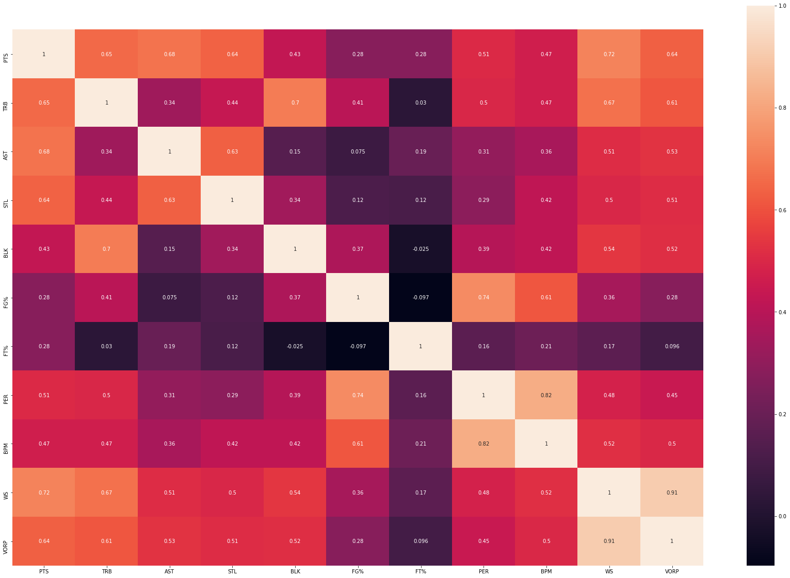


When looking at the results of the heat map we want to find statistics that are not heavily correlated with other statistics in our data. This would mean that we want to use statistics that have darker cells in the heatmap as opposed to cells that have lighter cells in the heatmap. By using this we can see that FT% and FG% are not heavily correlated with other statistics and thus should be included in our model. In addition to this we can see that the other counting stats (PTS, TRB, AST, STL, BLK are less correlated with other advanced statistics such as VORP and WS. This indicates that we should also include these counting stats in our model. When it comes to advanced statistics BPM and PER are less correlated with other stats such as WS and VORP and thus will be included in our model as well.

<center>
<h1 style="font-size:24px">Creating Test Data</h1>
</center>

We will be trying to predict the voting share column from our historical dataset. We will be trying to predict the voting share category because the player with the highest voting share will be the winner of the MVP award. The voting share is calculated by dividing the voting points won by the max amount of points that one could recieve during voting


```python
# Create training and test data using stats from heatmap.
X = past_mvp_voting[['PTS', "TRB", "AST", "STL", "BLK", "FG%", "FT%", "BPM", "PER"]]
y = past_mvp_voting.Share
X_train, X_test, y_train, y_test = train_test_split(X, y, test_size=0.2, random_state = 10)

prospective_mvps = prospective_mvps[['PTS', "TRB", "AST", "STL", "BLK", "FG%", "FT%", "BPM", "PER"]]

prospective_mvps
```


<div>
<style scoped>
    .dataframe tbody tr th:only-of-type {
        vertical-align: middle;
    }

    .dataframe tbody tr th {
        vertical-align: top;
    }

    .dataframe thead th {
        text-align: right;
    }
</style>
<table border="1" class="dataframe">
  <thead>
    <tr style="text-align: right;">
      <th></th>
      <th>PTS</th>
      <th>TRB</th>
      <th>AST</th>
      <th>STL</th>
      <th>BLK</th>
      <th>FG%</th>
      <th>FT%</th>
      <th>BPM</th>
      <th>PER</th>
    </tr>
  </thead>
  <tbody>
    <tr>
      <th>0</th>
      <td>38.0</td>
      <td>6.0</td>
      <td>7.5</td>
      <td>2.0</td>
      <td>0.6</td>
      <td>0.431</td>
      <td>0.879</td>
      <td>10.1</td>
      <td>31.1</td>
    </tr>
    <tr>
      <th>1</th>
      <td>30.9</td>
      <td>13.2</td>
      <td>5.5</td>
      <td>1.3</td>
      <td>1.3</td>
      <td>0.564</td>
      <td>0.588</td>
      <td>12.6</td>
      <td>33.7</td>
    </tr>
    <tr>
      <th>2</th>
      <td>30.0</td>
      <td>9.8</td>
      <td>9.2</td>
      <td>1.3</td>
      <td>0.1</td>
      <td>0.476</td>
      <td>0.814</td>
      <td>13.7</td>
      <td>32.1</td>
    </tr>
    <tr>
      <th>3</th>
      <td>28.8</td>
      <td>4.1</td>
      <td>8.4</td>
      <td>1.3</td>
      <td>0.0</td>
      <td>0.462</td>
      <td>0.860</td>
      <td>3.5</td>
      <td>23.4</td>
    </tr>
    <tr>
      <th>4</th>
      <td>28.0</td>
      <td>4.5</td>
      <td>7.0</td>
      <td>1.0</td>
      <td>0.2</td>
      <td>0.453</td>
      <td>0.836</td>
      <td>0.5</td>
      <td>20.2</td>
    </tr>
    <tr>
      <th>5</th>
      <td>27.7</td>
      <td>9.0</td>
      <td>3.3</td>
      <td>1.5</td>
      <td>2.7</td>
      <td>0.507</td>
      <td>0.870</td>
      <td>7.6</td>
      <td>29.8</td>
    </tr>
    <tr>
      <th>6</th>
      <td>26.7</td>
      <td>4.6</td>
      <td>7.4</td>
      <td>1.0</td>
      <td>0.5</td>
      <td>0.443</td>
      <td>0.911</td>
      <td>5.1</td>
      <td>24.5</td>
    </tr>
    <tr>
      <th>7</th>
      <td>26.1</td>
      <td>11.7</td>
      <td>4.5</td>
      <td>1.0</td>
      <td>1.4</td>
      <td>0.516</td>
      <td>0.800</td>
      <td>8.8</td>
      <td>28.1</td>
    </tr>
    <tr>
      <th>8</th>
      <td>25.9</td>
      <td>6.8</td>
      <td>10.8</td>
      <td>1.3</td>
      <td>0.5</td>
      <td>0.501</td>
      <td>0.705</td>
      <td>9.3</td>
      <td>27.3</td>
    </tr>
    <tr>
      <th>9</th>
      <td>25.5</td>
      <td>3.9</td>
      <td>6.3</td>
      <td>0.6</td>
      <td>0.3</td>
      <td>0.514</td>
      <td>0.908</td>
      <td>1.7</td>
      <td>19.9</td>
    </tr>
    <tr>
      <th>10</th>
      <td>25.1</td>
      <td>7.9</td>
      <td>5.2</td>
      <td>1.9</td>
      <td>0.8</td>
      <td>0.447</td>
      <td>0.853</td>
      <td>6.7</td>
      <td>25.0</td>
    </tr>
    <tr>
      <th>11</th>
      <td>24.9</td>
      <td>7.0</td>
      <td>4.0</td>
      <td>0.8</td>
      <td>0.9</td>
      <td>0.494</td>
      <td>0.839</td>
      <td>1.4</td>
      <td>21.2</td>
    </tr>
    <tr>
      <th>12</th>
      <td>24.7</td>
      <td>4.8</td>
      <td>3.6</td>
      <td>1.3</td>
      <td>0.3</td>
      <td>0.438</td>
      <td>0.839</td>
      <td>1.3</td>
      <td>19.7</td>
    </tr>
    <tr>
      <th>13</th>
      <td>24.5</td>
      <td>8.4</td>
      <td>3.6</td>
      <td>0.9</td>
      <td>0.7</td>
      <td>0.458</td>
      <td>0.811</td>
      <td>1.8</td>
      <td>18.7</td>
    </tr>
    <tr>
      <th>14</th>
      <td>24.5</td>
      <td>5.2</td>
      <td>3.4</td>
      <td>0.6</td>
      <td>1.3</td>
      <td>0.453</td>
      <td>0.724</td>
      <td>-0.5</td>
      <td>19.6</td>
    </tr>
  </tbody>
</table>
</div>


<center>
<h1 style="font-size:28px">Machine Learning Models</h1>
</center>

<center>
<h1 style="font-size:24px">Random Forest Regressor</h1>
</center>


```python
# Random Forest Regressor is created
regr = RandomForestRegressor(n_estimators = 10, max_depth=2, random_state=0)
regr.fit(X_train, y_train)

prediction = regr.predict(prospective_mvps)
prediction

plt.figure(figsize=(30,20))
results["Share"] = prediction
results = results.sort_values(by = ["Share"], ascending = False)
ax = sns.barplot(x = 'Player', y = 'Share', data = results)
ax.set_title("Random Forest Regressor Voting Share Predictions")
plt.show()
```


We can see in this graph that when using a Decision Tree Regressor model, James Harden and Luka Dočić are tied for the most voting shares with several players trailing behind them at the same voting share. 

<center>
<h1 style="font-size:24px">Decision Tree Regressor</h1>
</center>


```python
regressor = DecisionTreeRegressor(random_state=10)
regressor.fit(X_train, y_train)

plt.figure(figsize=(30,20))
prediction = regressor.predict(prospective_mvps)
results["Share"] = prediction
results = results.sort_values(by = ["Share"], ascending = False)

ax = sns.barplot(x = 'Player', y = 'Share', data = results)
ax.set_title("Decision Tree Regressor Voting Share Predictions")
plt.show()
```


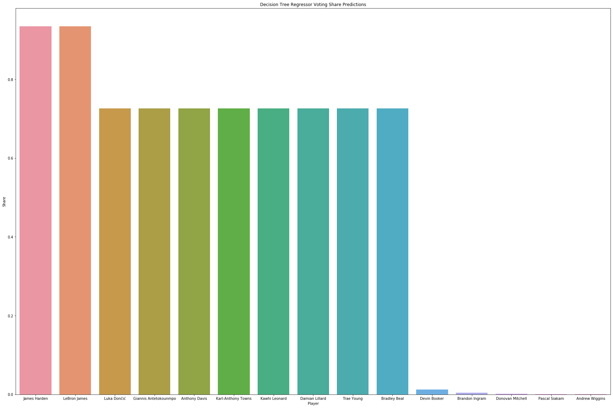


We can see in this graph that by using a Random Forest Regressor model, James Harden and LeBron James are tied in Voting shares with Karl-Anthony Towns, Trae Young, And Giannis Antetokounmpo following closely behind

<center>
<h1 style="font-size:24px">Linear Regressor</h1>
</center>


```python
reg = LinearRegression().fit(X, y)
reg.fit(X_train, y_train)

prediction = reg.predict(prospective_mvps)

plt.figure(figsize=(30,20))
prediction = reg.predict(prospective_mvps)
results["Share"] = prediction
results = results.sort_values(by = ["Share"], ascending = False)
ax = sns.barplot(x = 'Player', y = 'Share', data = results)
ax.set_title("Linear Regression Voting Share Predictions")
plt.show()
```


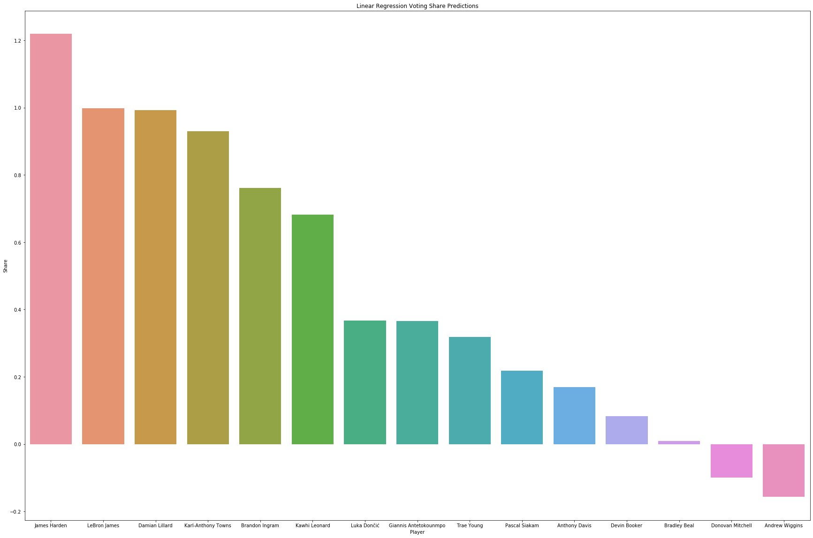


When we use a Linear Regression model we can see that James Harden has a considerable lead in voting shares.

So, if we look at the results of all three of our models we can see that James Harden is leading or tied for the lead in every prediction, therefore our models predicted that the 2019-2020 NBA MVP is James Harden.
<p></p>

